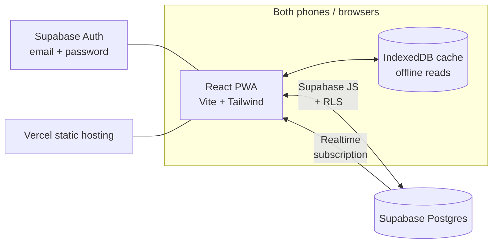
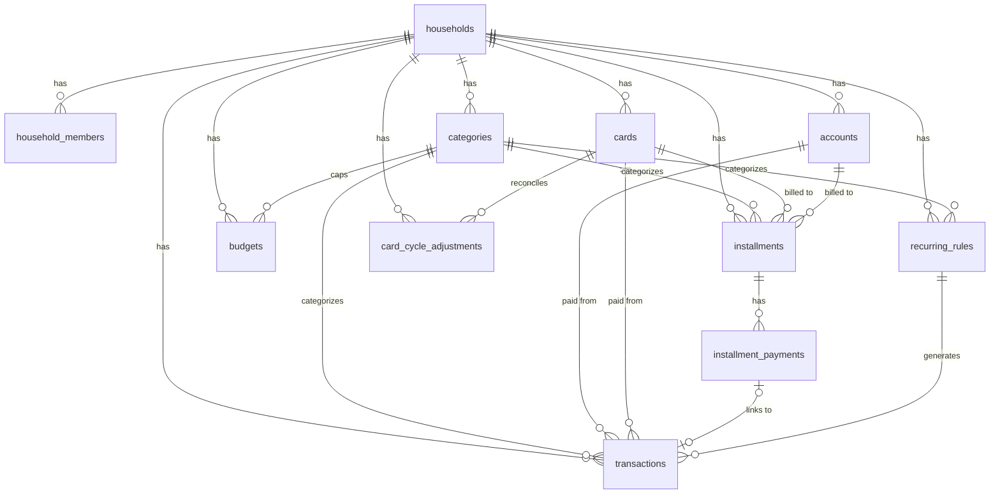

# Wealth Prof — System Analysis & Design (v3)

> Builds on [SPEC.md](./SPEC.md). Analyses the spec and proposes the architecture, data model, financial logic, UX and delivery plan for the real app in this repo.
>
> **v2 changes:** rewritten in English; added transfers as a first-class transaction kind (D7); added recurring transactions (D8); fixed credit-utilisation double counting, per-cycle card adjustments, soft delete, RLS coverage of child tables, interest-rate units, and the import strategy.
>
> **v3 changes (2026-07-31, after real phase-1 use):** transaction entry redesigned after the **Money Manager** app, which the user prefers over the v2 quick-add — a field-form sheet with pickers in a fixed bottom panel and an in-app calculator keypad (D9); two-level categories (D10); card-billed installment periods materialise as transactions automatically and every card gets a per-cycle statement view, replacing manual "mark period paid" (D11).
>
> **v3.1 changes (2026-07-31, navigation redesign):** Transactions becomes the landing tab (the user opens the app to jot and check entries); the month/person header renders only on tabs it applies to, and the month label opens a month-year picker; Home becomes **Overview** with a card-bills-due-this-month section (per billing cycle, tied to the month filter) and a collapsed category rollup; category icons become a nameless grid plus **emoji** as custom icons; stack decision recorded: stay TS + Supabase, self-maintainability via [ARCHITECTURE.md](./ARCHITECTURE.md) instead of a Go monorepo.

---

## 1. Spec analysis

### 1.1 What the spec already gets right (keep)

* Clear scope: an app for two people, not a multi-tenant SaaS — the design can stay genuinely simple.
* The prototype baseline already covers the full loop: record → track installments → plan.
* 600+ real records exist as a test set — no need to guess the use cases.

### 1.2 Changes from the prototype (key design decisions)

| # | Prototype | Problem | Proposal |
|---|---|---|---|
| D1 | Installment burden computed per **calendar month** | Real money moves on each card's **billing cycle** (statement day / due day), not per month — the source sheet already summarises per cycle | A **Billing Cycle Engine** as the one shared module (§6.1); Dashboard, forward calendar and the cards page all call it |
| D2 | "Periods paid" is a counter | Hard to correct a mis-tap, no record of when it was paid, not linked to transactions | Store each payment as an **event** in `installment_payments` (which period, when, optionally linked to a transaction). The counter becomes derived and undoable |
| D3 | Current-cycle card spend typed in by hand | Duplicates transactions that are already linked to the card; the two numbers drift | Compute it from transactions in the cycle, plus a **per-cycle adjustment row** to reconcile against the real statement |
| D4 | Account balances typed in by hand | One missed update and the number drifts permanently | **Reconcile pattern**: store "balance as of anchor date", let the system add/subtract transactions since. The user reconciles against the bank app occasionally |
| D5 | Interest rate buried in a free-text note ("installment 9.99%") | Avalanche ranking can't be automated | A real numeric `annual_interest_rate` field, normalised to **% per year** for every entity (§6.4), imported from the old notes via regex |
| D6 | One JSON blob, no auth | Concurrent edits clobber each other; anyone with the link sees everything | Postgres + Row Level Security + per-person login (§5) |
| **D7** | Only income and expense exist | Paying a credit-card bill, taking a cash advance and moving money between own accounts are none of those. Recording a card payment as an expense **double counts** it against the card purchases | Add `transfer` as a third transaction kind with a source and a destination, excluded from every income/expense total (§4.3) |
| **D8** | Every recurring item re-typed monthly | Salary, insurance, phone, subscriptions are the most repetitive entries; forgetting one silently breaks the monthly summary and the cash-flow forecast | **Recurring rules** that materialise real transactions on schedule and project future ones into the forward calendar (§4.4, §6.6) |
| **D9** *(v3)* | v2 quick-add: amount input first, system numeric keyboard, category icon grid in a scrolling drawer | On iOS the system keyboard shrinks the viewport and shoves the whole drawer up; the user must dismiss it and scroll to reach every other field. Recurring/installment entry lives in separate screens, so "coffee" and "new phone on 10-month plan" need different flows | **Money Manager-style entry form** (§7.2): stacked field rows, every picker (including the amount keypad) opens in a **fixed bottom panel** — the system keyboard opens only for free-text fields. The keypad is in-app with `+ − × ÷ =`. A Rep/Inst. control on the form creates a recurring rule or an installment inline |
| **D10** *(v3)* | Flat category list | Real usage wants "Food → coffee / restaurant / delivery" — one flat level either explodes into dozens of tiles or loses the detail; Money Manager's two-level picker is the model | Two-level categories: `parent_id` on `categories`, max depth 1 (§4.2). Transactions may point at a main or a sub; reports roll up to mains and drill down into subs |
| **D11** *(v3)* | Card-billed installment periods wait for a manual "mark period paid" tap | The charge hits the real statement whether or not anyone taps — un-marked periods make the app's cycle total drift from the statement, which is exactly the drift D3 was built to kill | **Auto-materialise** card-billed installment periods as transactions on their period date (same idempotent engine as D8), and give every card a **statement view**: its transactions grouped per billing cycle with the cycle total, due date and paid status (§6.7, §7.3) |

### 1.3 Pain point → the feature that answers it

* **Liquidity is tight in some months (~฿3,600 left)** → the Dashboard must surface "cash to set aside before the next due date" prominently, not just a monthly summary.
* **9.99% cash advances mixed in with 0% installments** → the payoff page must rank and colour by interest rate, and offer a simulator: "if I put ฿X extra per month towards debt, how much interest do I save?"
* **Two people's money not separated** → every record carries an owner, and every screen has the same person filter chip in the same place.
* **Repetitive data entry drove the user off the sheet on mobile** → quick-add in under 10 seconds (§7.2) *and* recurring rules so the fixed items never need typing at all.

---

## 2. Design principles

1. **Genuinely mobile-first** — every flow completable one-handed on a phone; desktop is the same components in a wider layout.
2. **Recording a transaction takes under 10 seconds** — the most frequent action. If it is slow, people stop recording, which is exactly why the sheet failed on mobile.
3. **One number, one source** — all financial logic (billing cycles, outstanding balances, credit utilisation) lives in one module that every screen calls. Never copy a formula.
4. **Everything is reversible** — destructive actions are soft deletes with an undo window; every derived counter is recomputed from events, never mutated in place.
5. **Start small, stay extensible** — the schema leaves room for the investing/retirement phase without implementing it early.

---

## 3. Tech stack

| Layer | Choice | Why |
|---|---|---|
| Frontend | **React 18 + TypeScript + Vite** (SPA) | No SSR needed — a private two-person app has no SEO. An SPA is easier to make offline-capable than Next.js and deploys as static files |
| UI | **Tailwind CSS + shadcn/ui** | Fast, good-looking mobile UI, free dark mode, easy to localise to Thai |
| State/Data | **TanStack Query** + Supabase JS client | Cache, optimistic updates, and persistence to IndexedDB (offline reads almost for free) |
| Backend/DB | **Supabase** (Postgres + Auth + Realtime) | Real database, auth, realtime sync and Row Level Security in one product; the free tier is ample for two users |
| Charts | **Recharts** | Light, sufficient for a trend line and a bar list |
| Drag-to-reorder | **@dnd-kit** *(v3)* | Touch-friendly, accessible, no legacy HTML5 drag-and-drop quirks on iOS Safari; used for the categories settings screen (§7.3) |
| PWA | **vite-plugin-pwa** (Workbox) | Installable, cached shell, offline reads |
| Hosting | **Vercel** (static) | Automatic deploys from GitHub, free custom domain |
| Testing | **Vitest** | Focused on the financial logic (billing cycles, recurrence, avalanche) |

**Considered and rejected:**

* *Next.js* — its main benefits are SSR and SEO, neither of which this app needs; server components add complexity for nothing.
* *Firebase* — Firestore is NoSQL; per-month and per-billing-cycle aggregation is far harder than in SQL.
* *A custom backend (Express/Nest)* — not worth it for two users; RLS replaces the API layer.

### Architecture



There is no API server of our own: the client talks to Supabase directly and security is enforced by **Row Level Security** in the database, so even a fully reverse-engineered client can only reach its own household's rows.

---

## 4. Data model

### 4.1 ERD



### 4.2 Core tables

```sql
-- Household: the sharing unit. In practice there is exactly one row,
-- but modelling it properly keeps RLS simple and uniform.
create table households (
  id          uuid primary key default gen_random_uuid(),
  name        text not null default 'Our household',
  created_at  timestamptz not null default now()
);

-- Members: links Supabase auth.users to a household.
create table household_members (
  id            uuid primary key default gen_random_uuid(),
  household_id  uuid not null references households(id) on delete cascade,
  user_id       uuid unique references auth.users(id),  -- null until the invite is accepted
  display_name  text not null,
  color         text not null default '#3b82f6',        -- the person's colour across the whole UI
  invite_code   text unique,
  created_at    timestamptz not null default now()
);

-- Ownership convention for every record type below:
--   owner_id = a member id, or null meaning "shared".
-- (A nullable FK rather than a person1/person2 enum, so names and the
--  number of people stay flexible.)

create type account_type as enum ('bank', 'cash', 'ewallet');

create table accounts (
  id             uuid primary key default gen_random_uuid(),
  household_id   uuid not null references households(id) on delete cascade,
  name           text not null,
  type           account_type not null default 'bank',
  owner_id       uuid references household_members(id),
  anchor_balance numeric(14,2) not null default 0,   -- balance as of anchor_date (see D4)
  anchor_date    date not null default current_date,
  sort_order     int not null default 0,
  archived       boolean not null default false,
  created_at     timestamptz not null default now(),
  updated_at     timestamptz not null default now(),
  updated_by     uuid references household_members(id),
  deleted_at     timestamptz                          -- soft delete (principle 4)
);

create table cards (
  id             uuid primary key default gen_random_uuid(),
  household_id   uuid not null references households(id) on delete cascade,
  name           text not null,
  credit_limit   numeric(14,2) not null,
  statement_day  int not null check (statement_day between 1 and 31),
  due_day        int not null check (due_day between 1 and 31),
  annual_interest_rate numeric(6,3) not null default 0,  -- % per year, always (see §6.4)
  owner_id       uuid references household_members(id),
  sort_order     int not null default 0,
  archived       boolean not null default false,
  created_at     timestamptz not null default now(),
  updated_at     timestamptz not null default now(),
  updated_by     uuid references household_members(id),
  deleted_at     timestamptz
);

-- D3: statement reconciliation is per billing cycle, not a single field on the card.
create table card_cycle_adjustments (
  id            uuid primary key default gen_random_uuid(),
  household_id  uuid not null references households(id) on delete cascade,
  card_id       uuid not null references cards(id) on delete cascade,
  cycle_start   date not null,                        -- identifies the cycle (see §6.1)
  amount        numeric(14,2) not null,               -- signed delta vs. the computed total
  note          text,
  created_at    timestamptz not null default now(),
  unique (card_id, cycle_start)
);

create type category_kind as enum ('income', 'expense');

create table categories (
  id            uuid primary key default gen_random_uuid(),
  household_id  uuid not null references households(id) on delete cascade,
  name          text not null,
  kind          category_kind not null,
  icon          text,
  parent_id     uuid references categories(id),       -- D10: null = main category
  sort_order    int not null default 0,
  archived      boolean not null default false,
  unique (id, kind)                                   -- supports the composite FK below
);
```

**Icons and colour (v3.1).** `categories.icon` stores either a **known icon key** (curated lucide set in `src/lib/categoryIcons.tsx`) or a **literal emoji string** typed by the user — the renderer falls back to printing the raw string when the key is unknown, so custom icons need no schema change, no upload, and work offline. The picker is a nameless icon grid plus an emoji input. `categories.color` (migration 0018, nullable hex) tints the lucide icons via `currentColor`; the swatch row shows on the icon tab only, since emoji carry their own colours and ignore a tint. Null keeps the neutral default, so no row needs backfilling.

**Sub-categories (D10).** `parent_id` gives exactly two levels: a main category (`parent_id is null`) and its subs. Depth stays at 1 — a sub's parent must itself be a main — enforced by a trigger (a plain `check` cannot look at the parent row). A sub inherits its parent's `kind` (also trigger-enforced). Transactions reference the most specific category the user picked: a main when no sub was chosen, otherwise the sub. Every report groups by the **effective main** (`coalesce(parent_id, category_id)`) and offers subs as the drill-down level. Existing flat categories migrate as mains, unchanged; archiving a main archives its subs.

### 4.3 Transactions (including transfers — D7)

`transfer` is a third kind alongside income and expense. It moves value between two of the household's own instruments (bank → card bill payment, card → bank cash advance, bank → bank). **Transfers are excluded from every income and expense total** — they only move balances. Without this, paying a card bill would be counted as an expense on top of the purchases it settles.

```sql
create type transaction_kind as enum ('income', 'expense', 'transfer');
create type transaction_source as enum ('manual', 'recurring', 'installment', 'import');

create table transactions (
  id            uuid primary key default gen_random_uuid(),
  household_id  uuid not null references households(id) on delete cascade,
  date          date not null,                        -- plain date, always read as Asia/Bangkok
  kind          transaction_kind not null,
  category_id   uuid references categories(id),       -- required for income/expense, null for transfer
  category_kind category_kind,                        -- denormalised for fast queries; kept honest by the FK below
  description   text not null default '',
  amount        numeric(14,2) not null check (amount > 0),
  owner_id      uuid references household_members(id),

  -- Where the money comes from, and (for transfers) where it goes.
  from_account_id uuid references accounts(id),
  from_card_id    uuid references cards(id),
  to_account_id   uuid references accounts(id),
  to_card_id      uuid references cards(id),

  note          text,
  source        transaction_source not null default 'manual',
  recurring_rule_id uuid references recurring_rules(id) on delete set null,
  occurrence_date   date,                             -- the scheduled date this instance came from
  confirmed     boolean not null default true,        -- false = generated, awaiting review (§6.6)
  created_by    uuid references household_members(id),
  created_at    timestamptz not null default now(),
  updated_at    timestamptz not null default now(),
  updated_by    uuid references household_members(id),
  deleted_at    timestamptz,

  -- Exactly one source instrument, and a destination only for transfers.
  constraint one_source check (num_nonnulls(from_account_id, from_card_id) = 1),
  constraint dest_iff_transfer check (
    case when kind = 'transfer'
         then num_nonnulls(to_account_id, to_card_id) = 1
         else num_nonnulls(to_account_id, to_card_id) = 0 end
  ),
  -- Categories apply to income/expense only, and the denormalised kind must match.
  constraint category_iff_not_transfer check (
    (kind = 'transfer') = (category_id is null)
  ),
  constraint category_kind_matches check (
    (kind = 'transfer' and category_kind is null) or category_kind::text = kind::text
  ),
  foreign key (category_id, category_kind) references categories(id, kind),
  -- Idempotent materialisation of recurring instances (§6.6).
  unique (recurring_rule_id, occurrence_date)
);
create index on transactions (household_id, date desc) where deleted_at is null;
create index on transactions (household_id, from_card_id, date) where deleted_at is null;
```

Notes:

* A transfer never has a category. Income and expense always do, and `category_kind` is kept in sync by the composite foreign key — it cannot drift.
* `unique (recurring_rule_id, occurrence_date)` is what makes recurrence generation safe to run from several devices at once. It ignores NULLs, which is correct here: manual rows have both columns null and are never deduplicated.
* Cash advances are modelled as `transfer` from the card to a bank/cash account. The debt itself is an `installments` row (§4.5) with `is_cash_advance = true`.

### 4.4 Recurring rules (D8)

A rule is a template plus a schedule. It generates real transaction rows; it is not a separate kind of money.

```sql
create type recurrence_freq as enum ('weekly', 'monthly', 'yearly');
create type month_end_rule as enum ('clamp', 'skip');   -- 31st in a 30-day month

create table recurring_rules (
  id            uuid primary key default gen_random_uuid(),
  household_id  uuid not null references households(id) on delete cascade,
  name          text not null,                          -- "Salary", "Car insurance", "Netflix"

  -- Transaction template
  kind          transaction_kind not null,
  category_id   uuid references categories(id),
  category_kind category_kind,
  amount        numeric(14,2) not null check (amount > 0),
  owner_id      uuid references household_members(id),
  from_account_id uuid references accounts(id),
  from_card_id    uuid references cards(id),
  to_account_id   uuid references accounts(id),
  to_card_id      uuid references cards(id),
  note          text,

  -- Schedule
  freq          recurrence_freq not null,
  interval      int not null default 1 check (interval > 0),  -- every N periods
  day_of_month  int check (day_of_month between 1 and 31),    -- monthly / yearly
  month_of_year int check (month_of_year between 1 and 12),   -- yearly
  weekday       int check (weekday between 0 and 6),          -- weekly (0 = Sunday)
  month_end     month_end_rule not null default 'clamp',
  start_date    date not null,
  end_date      date,                                         -- null = open ended
  max_occurrences int,                                        -- optional alternative to end_date

  -- Behaviour
  auto_post     boolean not null default false,  -- true: post confirmed; false: post unconfirmed for review
  variable_amount boolean not null default false,-- amount changes monthly (utilities) → always review
  active        boolean not null default true,
  last_generated_date date,                      -- watermark; generation resumes from here
  created_at    timestamptz not null default now(),
  updated_at    timestamptz not null default now(),
  updated_by    uuid references household_members(id),
  deleted_at    timestamptz,

  constraint one_source check (num_nonnulls(from_account_id, from_card_id) = 1),
  constraint dest_iff_transfer check (
    case when kind = 'transfer'
         then num_nonnulls(to_account_id, to_card_id) = 1
         else num_nonnulls(to_account_id, to_card_id) = 0 end
  ),
  constraint category_iff_not_transfer check ((kind = 'transfer') = (category_id is null)),
  foreign key (category_id, category_kind) references categories(id, kind),
  constraint schedule_fields check (
    case freq
      when 'weekly'  then weekday is not null
      when 'monthly' then day_of_month is not null
      when 'yearly'  then day_of_month is not null and month_of_year is not null
    end
  )
);
```

`transactions.recurring_rule_id` and `recurring_rules` reference each other, so in the actual migration the two tables are created first and the `transactions → recurring_rules` foreign key is added afterwards with `alter table`.

Why materialise rows rather than compute occurrences on the fly:

* Every existing screen (transaction list, monthly summary, category budgets, account balances) already reads `transactions`. Materialising keeps exactly one code path.
* Real amounts differ from the template (the electricity bill is never exactly the template amount). A materialised row can be edited; a virtual one cannot.
* Editing or deleting a rule must not silently rewrite history. Past instances are ordinary rows and stay as they were.

Future occurrences beyond today are **not** written to the database — they are projected in memory for the forward calendar (§6.6), so changing a rule instantly changes the forecast with nothing to clean up.

### 4.5 Installments

```sql
create type installment_status as enum ('active', 'done', 'cancelled');

create table installments (
  id              uuid primary key default gen_random_uuid(),
  household_id    uuid not null references households(id) on delete cascade,
  name            text not null,
  category_id     uuid references categories(id),
  start_date      date not null,                     -- period 1 falls in the cycle containing this date
  total_periods   int not null check (total_periods > 0),
  monthly_amount  numeric(14,2) not null,
  final_amount    numeric(14,2),                     -- last period often differs (rounding); null = same
  card_id         uuid references cards(id),
  account_id      uuid references accounts(id),
  annual_interest_rate numeric(6,3) not null default 0,  -- % per year, normalised (§6.4)
  is_cash_advance boolean not null default false,
  owner_id        uuid references household_members(id),
  note            text,
  status          installment_status not null default 'active',
  created_at      timestamptz not null default now(),
  updated_at      timestamptz not null default now(),
  updated_by      uuid references household_members(id),
  deleted_at      timestamptz,
  constraint one_instrument check (num_nonnulls(card_id, account_id) = 1)
);

-- D2: each period payment is an event, not a counter.
create table installment_payments (
  id              uuid primary key default gen_random_uuid(),
  household_id    uuid not null references households(id) on delete cascade,  -- denormalised for RLS (§4.7)
  installment_id  uuid not null references installments(id) on delete cascade,
  period_no       int not null check (period_no > 0),
  paid_date       date not null default current_date,
  transaction_id  uuid unique references transactions(id) on delete set null,
  created_at      timestamptz not null default now(),
  unique (installment_id, period_no)
);
-- periods paid = count(*); outstanding = see §6.2
```

`transaction_id` is the single source of truth for whether the money actually left an account: for account-billed installments the app always creates the paired transaction when a period is marked paid (see §6.3), so balances cannot drift.

**v3.2: `installment_payments` means *settled*, and only that — the schema did not change.** The materialiser (§6.7) writes every period's transaction up front and never writes a payment row; a row appears only when a human ticks the period, and un-ticking deletes it. So `count(*)` is "periods actually paid", not "periods elapsed", and the plan's `status` follows it in both directions — settling the last period retires the plan, un-ticking it reopens the plan rather than stranding it as `done`. D2 is unchanged: events, not counters, and every one of them is undoable.

### 4.6 Budgets

```sql
create table budgets (
  id            uuid primary key default gen_random_uuid(),
  household_id  uuid not null references households(id) on delete cascade,
  category_id   uuid not null references categories(id),
  amount        numeric(14,2) not null,
  month         date,          -- null = the default for every month; set = override for that month
  created_at    timestamptz not null default now(),
  updated_at    timestamptz not null default now(),
  -- NULLS NOT DISTINCT is required: without it Postgres treats every null month
  -- as unique and allows duplicate defaults for the same category.
  unique nulls not distinct (household_id, category_id, month)
);
```

### 4.7 Row Level Security

Every table carries `household_id` — including child tables such as `installment_payments` and `card_cycle_adjustments` — precisely so that one policy shape works everywhere.

```sql
-- Helper: the current user's household. SECURITY DEFINER so it can read
-- household_members without recursing into that table's own policy.
create function current_household_id() returns uuid
language sql stable security definer set search_path = public as $$
  select household_id from household_members where user_id = auth.uid()
$$;

-- household_members must NOT use the helper, or the policy recurses into itself.
alter table household_members enable row level security;
create policy self_row on household_members
  for select using (user_id = auth.uid());
create policy same_household on household_members
  for select using (household_id = current_household_id());

alter table households enable row level security;
create policy own_household on households
  for all using (id = current_household_id())
  with check (id = current_household_id());

-- Every other table, same shape:
alter table transactions enable row level security;
create policy member_all on transactions
  for all using (household_id = current_household_id())
  with check (household_id = current_household_id());
```

Applies identically to `accounts`, `cards`, `card_cycle_adjustments`, `categories`, `transactions`, `installments`, `installment_payments`, `budgets`, `recurring_rules`.

### 4.8 Soft delete

`deleted_at` on every user-editable table backs principle 4. Rules:

* All application reads go through views (`v_transactions`, …) that filter `deleted_at is null`. Screens never query base tables.
* Deleting sets `deleted_at`; the undo toast clears it. Undo therefore works from any device, not just the one that deleted.
* A nightly (or on-demand) purge removes rows soft-deleted more than 30 days ago.

---

## 5. Authentication and pairing

* **Supabase Auth with email + password** and a long-lived session. Magic links tend to break the flow on mobile (app switch to Gmail); a password is set once.
* First-run flow:
  1. Person 1 signs up → the system creates the household and their member row.
  2. Settings has an "invite your partner" button → generates an invite code / link.
  3. Person 2 signs up through the link → joins the same household.
* The Supabase refresh token keeps the session alive, so the app opens straight into the data. This satisfies "no complex login" without giving up security.
* `owner_id` on a new transaction defaults to the logged-in member and can be changed in the form.

---

## 6. Core financial logic

All of it lives in one module, `src/lib/finance/`, shared by every screen (principle 3), and is the main target for unit tests.

### 6.1 Billing cycle engine

Converts calendar months into each card's real billing cycles (D1):

```
For a card with statement_day = S and due_day = D:
  Cycle k covers:  (S of month M-1) + 1  →  S of month M
  Payment due on:  D of month M, or D of month M+1 if D <= S
  Short months (S = 31 in a 30-day month): use the last day of the month
  A cycle is identified by its start date (cycle_start), which is what
  card_cycle_adjustments keys on.
```

Key functions:

```ts
// Which date does period n of an installment fall on?
// start_date + (n-1) months, clamped to the last day of short months
// (31 Jan + 1 month = 28/29 Feb).
periodDate(inst: Installment, n: number): Date

// Which billing cycle does a date fall into for a given card?
cycleOf(card: Card, date: Date): Cycle   // { start, end, dueDate }

// What is due on a card for one cycle? Takes an options object (v3.1),
// because a caller that silently omits a term gets a plausible-looking but
// wrong number — which already happened once with paidPeriods.
//   sum(transactions charged to the card within the cycle, excluding transfers TO the card)
// + sum(installment periods falling in the cycle that are NOT yet materialised
//       as transactions — `paidPeriods` excludes the posted ones; see below)
// + sum(projected recurring charges, when `recurringRules` is supplied — v3.1)
// + the cycle's adjustment row, if any
cycleBill(input: CycleBillInput): number

// The cycle whose DUE DATE falls in month M — powers the Overview card-bills
// section and the Plan forward calendar (v3.1, §7.3).
cycleDueInMonth(card: CardLike, monthKey: string): Cycle

// Recurring charges scheduled on a card inside a cycle that are not yet real
// transactions (v3.1). Double-count guard: everything up to the rule's
// `last_generated_date` has already been materialised into a transaction by
// §6.6, so projection starts the day after that watermark.
projectedRecurringInCycle(rules, cycle, cardId): number
```

Transfers *to* a card are bill payments and must be excluded from `cycleBill` (they settle it) while still reducing the paying account's balance.

**v3 (D11) double-count guard:** once the materialiser (§6.7) turns a period into a real transaction, that period is inside the "transactions" term — the "installment periods" term must count **only periods with no `installment_payments` row yet** (i.e. future/projected ones). The pre-v3 formula counted every period in the cycle separately from transactions; keeping that after materialisation would double-count each charge. This mirrors the §6.2 rule and must be covered by the same unit tests.

### 6.2 Installment balances and credit utilisation

```
periods paid          = count(installment_payments)
remaining periods     = total_periods - periods paid
outstanding           = remaining periods × monthly_amount
                        (substituting final_amount for the last period if set)

-- The current cycle's periods are already inside cycleBill, so they must not
-- be counted again here. This was the double count in v1.
future installment charges = outstanding − (installment periods falling in the current cycle)

credit used (per card) = cycleBill(current cycle)
                       + unpaid balance carried from earlier cycles
                       + future installment charges
credit available       = credit_limit − credit used
```

### 6.3 Account balances (reconcile pattern — D4)

```
current balance = anchor_balance
                + sum(income into the account after anchor_date)
                − sum(expenses from the account after anchor_date)
                + sum(transfers into the account after anchor_date)
                − sum(transfers out of the account after anchor_date)
                (confirmed rows only — §6.6)

"Reconcile" = user types the real balance from their banking app
            → the system writes a new anchor at today's date
```

For installments billed directly to an account, marking a period paid always creates the paired transaction (`installment_payments.transaction_id`). That transaction is the only thing that moves the balance, so there is no path to double counting or to silent drift.

### 6.4 Interest rates and the payoff plan

**Unit normalisation.** The source sheet mixes units: "installment 0.74%" is per *month*, while a card's "9.99%" style rate is per *year*. Every rate in the schema is stored as **% per year**. The import converts monthly figures with `annual = monthly × 12`, and the installment form asks explicitly which unit the user is entering. Without this, avalanche ranking silently puts a 0.74%/month plan (8.9%/yr) below a 5%/yr card.

**Avalanche.** Rank active installments by `annual_interest_rate` descending — cash advances float to the top automatically — with ties broken by smallest outstanding balance first, so individual debts actually close.

**Simulator.** The user enters an extra monthly amount; the model applies it in avalanche order and reports (a) how many months earlier the debt clears and (b) approximately how much interest is saved. That saved-baht figure is what makes the feature get used.

0% plans that carry a fee are entered as the equivalent annualised rate in the same field.

### 6.5 Dashboard figures

* **Primary card — monthly summary**: income / expense / net for the selected month, split by person. Transfers are excluded from both sides. Answers "what did we spend this month?"
* **Secondary card — next billing cycle**: "set aside ฿X" = the sum of `cycleBill` across all cards whose next due date has not passed, plus installment periods billed directly to accounts in the same window, plus projected recurring expenses (§6.6) falling before that date — listed by due date with an "in N days" countdown. Answers "what's coming and how much do I need?"

### 6.6 Recurrence engine (D8)

```ts
// Every scheduled date for a rule in a window, honouring interval, end_date,
// max_occurrences and the month_end rule (31st → 28/29/30 to clamp, or skipped).
occurrences(rule: RecurringRule, from: Date, to: Date): Date[]

// Materialise everything due up to `today` that does not exist yet.
// Safe to run concurrently: insert ... on conflict (recurring_rule_id,
// occurrence_date) do nothing, backed by the unique constraint in §4.3.
materialiseDue(rules, today): Transaction[]

// Future occurrences as in-memory rows for the forward calendar. Never written.
projectForward(rules, from, to): ProjectedTransaction[]
```

**When it runs.** On app open and on regaining focus, the client generates anything due up to today. No cron or edge function is needed: the app is opened daily, the unique constraint makes repeats harmless, and a gap of any length is caught up in a single pass on the next open.

**Confirmed vs. unconfirmed.** A rule with `auto_post = true` (fixed, reliable amounts such as salary or a subscription) writes `confirmed = true` rows that count immediately. Otherwise, and always when `variable_amount = true`, rows are written with `confirmed = false`: they appear in a "review" strip at the top of the Transactions tab, are excluded from account balances and monthly totals until confirmed, and the review action is a single tap (or an amount edit, then tap).

**Editing a rule** changes future occurrences only. Already-materialised rows are ordinary transactions and are untouched; the UI says so explicitly when saving. Deleting a rule offers "keep past entries" (default) or "delete generated entries too".

**Relationship to installments.** Installments are *not* recurring rules — they have a known number of periods, a payoff balance and an interest rate, and they feed the debt plan. Recurring rules are open-ended obligations. Keeping them separate keeps both models honest.

### 6.7 Installment materialiser (D11 — v3)

The same shape as §6.6, applied to installment periods:

```ts
// Materialise every period of every active installment whose periodDate
// (§6.1) is <= today and has no installment_payments row yet.
// Idempotent the same way: the generated transaction carries
// source = 'installment' and source_key = `installment:<id>:<period_no>`,
// backed by the existing unique index on (household_id, source, source_key);
// insert ... on conflict do nothing, then write the payment row linked to it.
materialiseInstallmentsDue(installments, today): Transaction[]
```

* **Every period posts at once, including future ones** *(v3.2)* — a plan is a set of known, dated, unavoidable charges, so hiding the future ones made them invisible in the months they actually land. `materialiseInstallmentsDue` runs whenever the plan list changes, so a plan created just now has its whole schedule in the ledger immediately, each row described `<name> (งวดที่ n/total)`.
* **Posting is not settling** *(v3.2)*. Posted rows are `confirmed = true` (the user committed to the schedule when they entered the plan; a second review tap adds nothing). Whether the money has actually gone out is the separate `installment_payments` event, written by ticking the period — a checkbox that appears in the ledger only on **card-billed** periods, the one case where the two genuinely differ: the charge is on the statement the moment the period lands, but the money leaves only when that statement is paid. Account-billed periods have no such gap and are ticked from the Installments screen's period grid.
* Runs in the same on-open/on-focus pass as `materialiseDue` — one shared "catch up now" entry point.
* Editing/cancelling an installment affects future periods only; posted periods are ordinary transactions, exactly like edited recurring rules.
* `projectForward` gains a sibling for installments so the forward calendar and `cycleBill`'s projection term (§6.1) come from one function, not two formulas.

---

## 7. UX design

### 7.1 Screen structure (mobile-first) — v3.1

```
┌──────────────────────────────┐
│  ‹ Jul 2026 ›  [P1|P2|Shared|All]   ← header only on Transactions/Overview
│                              │        (tap the month → month-year picker)
│         tab content          │
│                              │
│                        (+)   │  ← FAB, floating on every tab
├──────────────────────────────┤
│ Txns  Overview  Accounts  Plan  Settings │  ← 5-tab bottom nav
└──────────────────────────────┘
```

* **Transactions is the landing tab** *(v3.1)* — the observed daily habit is "open → jot what was spent → check what's been recorded", so the ledger comes first; the old Home is renamed **Overview** and moves to slot two.
* **The month/person header renders only on the tabs it filters** *(v3.1)*: Transactions and Overview. Accounts shows current state and Plan is forward-looking — a month filter there was noise. The month/person state itself stays global and URL-persisted, so switching tabs never resets it.
* **Month-year picker** *(v3.1)*: tapping the month label opens a drawer with a year stepper and a 12-month grid plus a "This month" shortcut (the Money Manager pattern) — replaces tapping ‹ twelve times to reach last year.
* Desktop: the bottom nav becomes a sidebar and content goes two-column. Same components throughout.

### 7.2 Transaction entry: the most important flow (principle 2) — v3, Money Manager style (D9)

The v2 quick-add (amount-first with the system numpad auto-opening over a scrolling drawer) failed in real use on iOS: the keyboard shrinks the visual viewport, the drawer gets shoved up, and reaching any other field means dismissing the keyboard and scrolling back. v3 adopts the layout of the **Money Manager** app, which the user knows and prefers:

```
┌──────────────────────────────┐
│  [ Income | Expense | Transfer ]     ← segments (unchanged)
│  Date      Fri 31/07      ⟳ Rep/Inst.
│  Amount    240.00                    ← opens keypad below, not the keyboard
│  Category  Food › Coffee             ← opens picker below
│  Account   KTC                       ← opens picker below
│  Note      _______________           ← free text, system keyboard OK
├──────────────────────────────┤
│        fixed picker panel            ← swaps between keypad /
│   (keypad · category grid · …)         category grid / instrument list
└──────────────────────────────┘
```

1. **A stacked field form on top, one fixed picker panel below.** Tapping a field row swaps the panel's content; the form itself never moves or scrolls. The panel is part of the sheet, not an overlay, so the form rows stay visible and tappable the whole time.
2. **The amount keypad is in-app** — digits plus `+ − × ÷ =`, so quick arithmetic ("120+85+60") happens inline, and the **system keyboard never opens for the amount**. This is the durable fix for the iOS viewport-shove bug; the system keyboard appears only for note/description, which sit last so nothing else needs reaching while it is up.
3. **Category panel is the D10 two-level grid**: main categories ordered by frequency of use; a main with subs expands them in place (Money Manager's chevron pattern); a main without subs selects immediately. Long-press → manage categories.
4. **Rep/Inst. lives on the form** (next to the date, as in Money Manager): one control that turns the entry into a recurring rule ("repeat") or an installment plan ("instalment", asking only periods + optional final amount) with everything already typed carried over. No separate screens to start from.
5. Smart defaults unchanged: date = today, kind = expense, owner = the logged-in person, instrument = last used with that category. Save → optimistic update with undo in the toast.

Target unchanged: a ฿65 coffee is **four taps** — FAB → `6` `5` → Food → Save (amount panel is the default on open).

Transfers swap the category panel for a from/to instrument picker, as before. Card-bill payment stays a preset on the card statement view (§7.3) with the amount pre-filled from `cycleBill`.

### 7.3 Other screens (only where they differ from the baseline)

* **Overview** (was Home; v3.1): the planning page, driven by the selected month M —
  1. Monthly cash-flow summary (income/expense/net) and the by-person split, as before.
  2. **Card bills due in month M**: one row per active card showing the billing cycle **whose due date falls in M** — cycle range label ("20 Jul – 19 Aug"), `cycleBill` total (with the §6.1 double-count guard), due date, and a paid indicator (transfers to the card inside the cycle vs. the bill). Header total = "cash to prepare for cards this month". Viewing next month answers "เดือนหน้าต้องเตรียมเท่าไหร่". Tapping a row opens the card statement view anchored to that cycle. This replaces the today-anchored "set aside" card, which could not look ahead.
  3. **Spending by category, collapsed by default** (one summary row; tap to expand) and rolled up to **effective mains** (D10): a sub-filed transaction counts under its parent; a main with subs expands inline to its sub breakdown; tapping navigates to Transactions filtered by that category (a main's filter matches its subs' transactions too).
* **Transactions**: a review strip at the top when unconfirmed recurring rows exist; below it, a list grouped by day. Each row shows category icon, description, instrument, owner colour and amount. Swipe to edit/delete, full-text search. Transfers render with a distinct arrow treatment and are visibly excluded from the totals.
* **Installments**: a card per plan with a progress bar and a red badge for rates ≥5% p.a. *(v3)* Card-billed plans no longer have a pay button — periods post themselves (§6.7) and the row shows "posted through period n/N" instead; account-billed plans surface their due period in the review strip rather than here. Completed plans collapse into a "finished" section.
* **Accounts**: two sections (accounts and cards) per the baseline. Cards show a mini gauge of used vs. available credit and the next statement/due dates; accounts have a Reconcile button.
  * **Deleting an account or card** *(v3.1)*: swipe-left, then a dialog that asks what happens to its transactions, because both answers are legitimate and destroy different things — a mistyped account should take its rows with it, a bank you have closed has real history worth keeping. Keeping them is safe: `useInstrumentNames` resolves labels from a lookup that **includes deleted rows**, so a past expense still names the account it came from instead of degrading to a generic "Account". Both the instrument and (optionally) its transactions are soft-deleted, so a mistake is recoverable in the database.
  * **Recurring rules and installments block the delete** rather than being swept along. Both keep generating transactions on a schedule, so a deleted instrument would quietly accumulate rows pointing at nothing; and removing someone's salary rule as a side effect of tidying an account destroys more than the action promises. The dialog lists what is still scheduled and asks the user to repoint it first.
* **Card statement view** *(v3 — D11)*: tapping a card opens its transactions grouped by **billing cycle**, newest first — the in-app version of the old sheet's per-cycle summary (SPEC §5), and the reason auto-posting matters: the list should read like the issuer's statement. Each cycle section has a header with the cycle date range, `cycleBill` total, due date, and a paid indicator (transfers to the card in the window vs. the total); inside are that cycle's charges — manual spends and auto-posted installment periods alike, the latter tagged with their period number ("Notebook · 4/10"). Swiping between cycles moves through history; the current (open) cycle sits on top with its projected remainder in a lighter tone. "Reconcile to statement" (writes a `card_cycle_adjustments` row) and "pay bill" (pre-filled transfer) both live in the cycle header.
* **Plan**: sub-tabs — **card bills** *(built, v3.1)*, **recurring rules** (list of rules with next occurrence date, amount, owner; toggle active; add/edit), **installments**, and later budgets (green/amber/red bars) and debt payoff (avalanche plus simulator).
  * **Card bills (forward calendar)** *(v3.1)*: the in-app version of the sheet's per-card-per-cycle table (SPEC §5's most valuable output). Six months from the current one, **month-major** — each row is a month showing the combined bill across every card, expanding to the per-card breakdown (card name, cycle range, due date, amount). Month-major rather than a months × cards matrix so it scrolls vertically on a phone with no horizontal panning; the highest month is badged so a spike is visible without reading every number.
  * A future cycle has no recorded transactions, so its figure is **committed charges only**: installment periods plus projected recurring charges. It is never a forecast of discretionary spending, and the tab says so under the list. A switch toggles the recurring projection off, to separate "what is contractually locked in" from "what the subscriptions add".
* **Categories screen (Settings)** *(v3 — extends D10, added 2026-07-31)*: a dedicated settings screen, modelled on Money Manager's category manager, replacing the D10 inline-expand list. Income/Expense tabs at top. The list shows **main categories only**, each row: icon, name, an inline sub-count and preview ("Food(5) — Lunch, Dinner, Eating out…"), a **drag handle** for reordering (writes `sort_order`, replacing the D10 up/down-arrow buttons), an edit pencil, and a delete control. Tapping a row's name/icon area (not the drag handle) **drills down** into that main's own screen — same list chrome, header shows the main's name with its own edit pencil and an "add sub-category" `+`, body lists its subs with the same drag/edit/delete row shape. This replaces D10's inline expand-in-place with a real navigation stack, matching the reference app and keeping each screen's list short.
  * **Delete vs. archive**: the delete control checks first whether any transaction, recurring rule, or installment references the category (or, for a main, any of its subs). If none do, it **hard deletes** the row. If it's in use, delete instead **archives** it (existing D10 behaviour: a main's archive cascades to its subs) — a category with real financial history must never silently disappear out from under those records via a dangling FK or an orphaned reference; the choice of hard-delete-when-safe keeps the list from accumulating clutter from typos and abandoned experiments, which is the main reason a delete affordance was requested at all.
  * **Deleting is swipe-then-confirm** *(v3.1)*: rows reveal Delete on swipe-left (same gesture as the transaction ledger) rather than carrying a permanently visible destructive button, and the confirmation names both consequences that aren't guessable from a trash icon — a main takes its sub-categories with it, and anything still referenced is archived instead of removed.
  * Reordering only ever swaps `sort_order` within the same level (mains among mains, a main's subs among each other) — it can't be used to re-parent a category; re-parenting (moving a sub under a different main) is not supported in v3.

### 7.4 Language and formatting

* The UI is entirely in Thai. Amounts are formatted `1,234.50` in baht; dates use the abbreviated Buddhist-era form ("21 ก.ค. 69").
* Each person has a colour (person 1 blue, person 2 orange, shared purple) used consistently in chips, card borders and charts. It is stored on `household_members.color`.

*(These design documents are in English for implementation; the product UI is Thai.)*

---

## 8. Real-time sync and offline

* **Sync**: subscribe to Supabase Realtime (`postgres_changes` scoped to the household) → invalidate TanStack Query → the UI updates within about a second when the other person records something. No CRDT or merge logic: genuine conflicts are almost non-existent (different records), and same-record conflicts are last-write-wins, with `updated_at` / `updated_by` recorded so it is at least visible who changed what.
* **Offline, phase one: read-only**
  * The PWA caches the app shell, so the app always opens.
  * TanStack Query persists to IndexedDB, so the last-loaded data is visible behind an "offline — data as of <time>" banner.
  * Writes while offline are disabled in phase one, with the reason shown on the disabled button. A write queue has too many edge cases (the same record edited on two devices) to be worth it before the app is otherwise finished.
* **PWA**: manifest and icons give "Add to Home Screen" on iOS and Android, fixing the prototype's missing app icon.
* **Local data is sensitive.** The IndexedDB cache holds the household's full financial history in plaintext on the device. Logging out must clear the cache and the Supabase session, and Settings needs an explicit "clear data on this device" action. This is a stated trade-off of offline support, not an oversight.

---

## 9. Importing from the Google Sheet

* A script, `scripts/import-sheet.ts`, consuming CSV exports of four tabs: Transactions, Installment, Credit Card, Accounts.
* Key mappings:
  * Interest rates in the note field ("installment 0.74%", "installment 9.99%") → regex-extracted, **converted to % per year** (§6.4); 9.99% entries set `is_cash_advance = true`.
  * "Periods paid = n" → generate `installment_payments` for periods 1..n with `paid_date` from `periodDate`.
  * Records without a person → owner = shared (editable later).
  * Card-bill payments in the sheet → `transfer` rows, not expenses (D7), so historical monthly totals are correct from day one.
  * Obvious repeating items (salary, insurance, phone) are reported at the end as **suggested recurring rules**; the user accepts or ignores each. The import never creates rules silently.
* **Upsert, not wipe.** Every imported row carries `source = 'import'` and a `source_key` (sheet tab + row identity) with a unique index; re-running updates matching rows and inserts new ones. It never touches rows created in the app. The v1 plan ("clear the household, then insert") would have destroyed real data the moment the re-import button was pressed after phase 1 — it is replaced by this.
* After importing, a summary screen shows record counts by type and every row that failed to parse, for review.

---

## 10. Roadmap

| Phase | Scope | Done when |
|---|---|---|
| **0. Foundation** | Vite + TS + Tailwind project, Supabase (schema, RLS, migrations), CI (typecheck + test), Vercel deploy | The URL opens, login works, the schema is complete |
| **1. Core capture** | Auth + invite, accounts/cards/categories CRUD, transactions including transfers, quick-add, recurring rules, sheet import, **read-only per-cycle card totals** | Both people use it instead of the sheet day to day, and the per-card, per-cycle figure matches the sheet |
| **2. Installments and cycles** | Installments + period payments, full Billing Cycle Engine with unit tests, Dashboard "set aside", credit utilisation | The "due per card per cycle" figure matches the old sheet for every card |
| **2.5 v3 revamp** *(added 2026-07-31)* | Money Manager-style entry form with in-app calculator keypad (D9), sub-categories + migration (D10), installment materialiser + card statement view, retiring "mark paid" for card-billed plans (D11), `cycleBill` double-count guard (§6.1) | Adding any transaction — one-off, recurring or installment — starts from the same form with no system-keyboard jump; each card's statement view matches the real statement for the last three cycles |
| **3. Planning** | 12-month forward calendar (including recurring projections), category budgets, avalanche + simulator | It can actually drive a payoff decision |
| **4. Polish** | PWA + offline reads *(shipped early, 2026-07-30)*, realtime sync, dark mode, full charts, reconcile | Installed on both phones and pleasant to use |
| **5. Future** | Investment and retirement planning (undesigned), due-date push notifications, data export | — |

> Phase 1 is the "can replace the sheet" milestone and should be reached as fast as possible, then validated with real use before phase 2 begins. Note that the per-cycle card total moved into phase 1 as a read-only view: it is the single most valuable thing the old sheet produced, so the app cannot claim to replace the sheet without it.

---

## 11. Risks and cautions

* **Billing-cycle correctness is risk number one.** A wrong number means the wrong amount of cash set aside. Unit tests must cover: statement days at month end (29/30/31), due dates crossing into the next month, first and last periods, and leap years — and **the output must be reconciled against the real figures in the old sheet, for every card, before it is trusted.**
* **Recurrence correctness is risk number two.** A duplicated or missed salary silently corrupts the monthly summary. Tests must cover: the same rule generated concurrently from two devices, a rule edited mid-stream, `day_of_month = 31` under both `clamp` and `skip`, catching up after a long absence, and end conditions (`end_date` and `max_occurrences`).
* **Sensitive financial data** — RLS on every table, never store real card numbers (display names only), never send financial values to any analytics service, and clear the local cache on logout (§8).
* **Timezone** — store `date` as a plain date, not a timestamp, always interpreted as Asia/Bangkok, so a record entered near midnight cannot land in the wrong day or the wrong billing cycle.
* **Supabase free tier** — projects pause after seven days with no traffic. Daily use avoids it, but a scheduled ping is available as mitigation.
