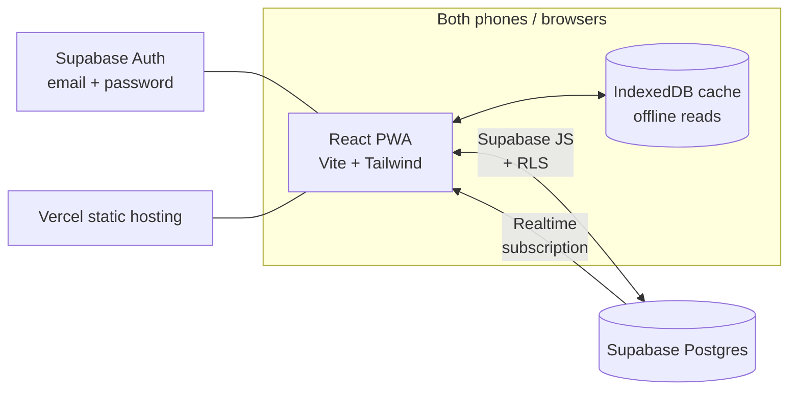
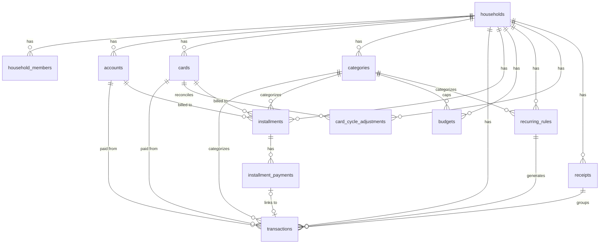

# Wealth Prof — System Analysis & Design (v3)

> Builds on [SPEC.md](./SPEC.md). Analyses the spec and proposes the architecture, data model, financial logic, UX and delivery plan for the real app in this repo.
>
> **v4.2 changes (2026-08-19, after grilling categories):** the ask was "more categories, or deeper ones"; the constraint turned out to be that **`transactions.category_id` is one column**, so a single ฿1,800 Makro payment covering fresh food, snacks and a saucepan has to file the whole basket under one heading — a limit no length of category list and no third level moves. The household's tree already holds 19 mains and 47 subs and still cannot record it. A **Receipt** (D22, [ADR-0015](./adr/0015-a-receipt-groups-transactions-and-holds-no-money.md), §4.3a) groups the several Transactions one payment produced, sharing a date and an Instrument, and **holds no money of its own** — an id and a name, with its total read back from its Transactions — so every figure in the app keeps summing a flat list of Transactions and stays right without ever learning what a Receipt is. Splitting is an **edit, not an entry mode**: a Transaction is recorded normally and then converted by stamping `receipt_id` on the row that already exists, so entry stays inside D9's tap budget and the three foreign keys pointing at `transactions.id` never move. Line items and a full-amount parent row were both considered and rejected — the first for creating a second table obliged to sum to `transactions.amount` along an axis independent of `transaction_shares`, the invariant migration 0022 already deadlocked three triggers over; the second for reviving the double-count bug D7 and §6.7 have each shipped once. **Depth stays at 1** (D10 unchanged) and **no categories are added**: the bulk import ([ADR-0014](./adr/0014-bulk-import-is-in-app-insert-only-and-has-no-heuristics.md)) turns every unmatched row into a named error, so running it against the real sheet produces the list of genuinely missing categories that guessing now cannot. Also recorded: **[CONTEXT.md](../CONTEXT.md) gains `Category`**, which the glossary had never defined despite it being the axis every report groups by, and `Receipt` beside it.
>
> **v4.1 changes (2026-08-13, bulk import rewritten before its first real run):** `scripts/import-sheet.ts` — written in phase 1, never run against the real sheet — turned out unsafe to run at all once grilled: its `source_key` was the CSV row's own index, so inserting one row mid-sheet shifted every key below it, and re-running upserted onto the wrong record while keeping its id; and it wrote account opening balances to `accounts.anchor_balance`/`anchor_date`, columns [ADR-0013](./adr/0013-anchors-accumulate-and-reconcile-is-an-action.md) had already made dead weight, which would have rendered every imported account at ฿0. It's replaced by an in-app screen (§9, [ADR-0014](./adr/0014-bulk-import-is-in-app-insert-only-and-has-no-heuristics.md)) that is **insert-only** (superseding §9's old "upsert, not wipe") and has **no heuristics** — every guess the script made (unmatched category → "Other", a note's percentage classified by magnitude, a label pattern-matched to a subscription) is replaced by a template the household fills in and a preview screen where every row that doesn't resolve is a named, editable error instead of a silent wrong answer.
>
> **v4 changes (2026-08-07, the responsive redesign — recorded here after the fact; the code shipped first):** the app **works on a desktop**, which it previously did not: app code held exactly one breakpoint class, no `@media` rules and no media-query hook, and `AppShell` hardcoded mobile at five points, so a laptop got a phone screen stretched to 1920px. Above `lg` it is now **three regions** — nav rail · ledger · summary column ([ADR-0010](./adr/0010-desktop-is-three-regions.md), §7.1), delivering a line §7.1 had promised since v3.5; below `lg` nothing changed. **The palette becomes Emerald and the type becomes self-hosted IBM Plex** — Sans for Latin, Sans Thai Looped for Thai, Mono for figures ([ADR-0009](./adr/0009-emerald-and-self-hosted-ibm-plex.md), §7.4), superseding both ADR-0005's system-font rule and v3.6's terracotta: the chrome went English but *the data never stopped being Thai*, so the app had been setting "Food → กาแฟ" in two unrelated typefaces on every screen. **The browser Back button works** ([ADR-0011](./adr/0011-url-state-uses-pushstate-so-back-works.md)) — `useUrlState` used `replaceState` and nothing listened for `popstate`, so Back left the app entirely from anywhere in it; masked on a phone by the edge-swipe gesture, a hard failure the moment a desktop layout existed. Also: the app has a **focus ring** for the first time (fourteen `active:` rules, six `hover:`, zero `focus-visible`), `SwipeableRow`'s Delete is reachable without a touchscreen at all, and `EntryPage` becomes a centred dialog above `lg` while its mobile path stays untouched.
>
> **v3.9 changes (2026-08-09, after grilling Balances and the entry flow):** **Balances stops answering "how much can I still use?" and starts answering "what do I owe next?"** (D20, [ADR-0012](./adr/0012-balances-rows-answer-what-is-due-next.md), §6.3c) — a card row leads with its most recently closed Cycle Bill and due date, the Accounts section totals money held and the Credit cards section totals **Set Aside**, and available credit is now summed nowhere at all. This fills the one gap in CONTEXT.md's three questions: *how much cash to set aside before each card's bill is due* had no home on any screen, while `cardOutstanding` — unbounded by design (ADR-0001) — was being read as if it were that number. **A payment now settles the cycle that had most recently closed when it was made**, fixing a `paidSoFar` that attributed by window and so showed "฿0 paid" on settled bills. **Anchors accumulate instead of overwriting** (D21, [ADR-0013](./adr/0013-anchors-accumulate-and-reconcile-is-an-action.md), §6.3) so that **Drift** — the evidence of a Transaction nobody recorded, which is the whole point of D4 — survives being corrected, and historic balances stay computable; Reconcile becomes a real action and the word "anchor" leaves the interface. Between-us moves directly under the net-worth headline, since it holds the screen's only pending action and renders nothing when there is none. Balances/Upcoming split on **closed versus still moving**. The entry form opens its keypad on mount (it never did, despite §7.2 claiming otherwise) and stops giving six rows equal weight when only two are questions — **without hiding any of them**, which is what D17 exists to prevent. **Search leaves the month**: it only ever searched the month on screen, and said nothing about it. **Upcoming is reorganised by purpose rather than by entity** — a single forward timeline on top, management lists below — which also kills a silent overlap where a card-billed subscription sat inside both `CardForecastTab`'s months and `RecurringTab`'s "Fixed costs"; the word **"committed" is retired** in favour of the Posted/Projected distinction CONTEXT.md already draws, and both are shown at once instead of behind a toggle, because the gap between them is the most useful thing on the screen. **Rows awaiting review stop hiding**: they are subtracted from every figure in the app and were announced on exactly one strip on one screen. And `cycleBill` now filters unconfirmed rows itself instead of trusting four separate callers to remember. The vocabulary — `Anchor`, `Reconcile`, `Drift`, `Set Aside` — lives in [CONTEXT.md](../CONTEXT.md).
>
> **v3.8 changes (2026-08-06):** the Transaction/Recurring Rule/Installment Plan full-screen page (`EntryPage`) is portalled to `document.body` instead of rendering in place — its edit path is opened from inside a screen, which sits inside `AppShell`'s own scrollable `<main>`, and on iOS Safari a `position: fixed` element nested inside a scrolling ancestor does not reliably stay pinned to the viewport ("the header doesn't stay on top"); the FAB's add flow and Settings never hit this because App.tsx already rendered both as siblings of `AppShell`. A card's detail now reuses Records the same way an account's already did — §7.3, D-adjacent — collapsing `CardCycleDialog`'s duplicate transaction list into one code path; the header swaps its month arrows for real billing-cycle arrows and the summary bar for `CardCycleSummary` (bill total, utilisation, reconcile) whenever a card is the active filter.
>
> **v3.7 changes (2026-08-06, after grilling accounts and per-person money):** an instrument with no owner becomes a **Common Pot** with a stated meaning rather than an unlabelled null — no per-person breakdown, contributions read back from the transfers that funded it, and no Debt on anything spent from it (D18, [ADR-0007](./adr/0007-a-shared-instrument-is-a-common-pot-not-a-third-owner.md)); a third "Shared" pseudo-member and a stored ownership ratio were both considered and rejected, for breaking D14's `A + B = All` and for drifting the way D4 warns about respectively. **Balances honours the person filter** so the app still works as a single-person ledger, with the pot in its own always-visible section. Joint *investment* accounts are named as out of scope. **Balances also gets its numbers defined for the first time** (D19, [ADR-0008](./adr/0008-balances-shows-capacity-per-row-and-net-worth-in-the-headline.md), §6.8): each row states spending capacity, the headline states net worth including inter-member debts — which is what makes `A + B = All` hold — and account sums are bounded by today while card debt is not, an asymmetry that follows from ADR-0001. The vocabulary lives in [CONTEXT.md](../CONTEXT.md).
>
> **v3.6 changes (2026-08-06, after grilling mobile smoothness):** the Transaction, Recurring Rule and Installment Plan forms move from a `Drawer` to a **full-screen page with one shared bottom picker panel** that Amount, Category, Account/card and Date all open, replacing each row's own inline-expanding behaviour and the "Edit" toggle entirely (D17, [ADR-0006](./adr/0006-full-screen-entry-with-one-shared-picker-panel.md)); **Who bears becomes a persistent row** with a one-tap button per other household member for "entirely theirs," fixing what previously took three taps to reach; the sub-category grid drops its icons, keeping only the main-category level illustrated; and `--radius` drops app-wide from `1rem` to `0.5rem`, pulling the whole UI toward a less rounded, more minimal register now that colour (not roundness) carries the app's personality.
>
> **v2 changes:** rewritten in English; added transfers as a first-class transaction kind (D7); added recurring transactions (D8); fixed credit-utilisation double counting, per-cycle card adjustments, soft delete, RLS coverage of child tables, interest-rate units, and the import strategy.
>
> **v3 changes (2026-07-31, after real phase-1 use):** transaction entry redesigned after the **Money Manager** app, which the user prefers over the v2 quick-add — a field-form sheet with pickers in a fixed bottom panel and an in-app calculator keypad (D9); two-level categories (D10); card-billed installment periods materialise as transactions automatically and every card gets a per-cycle statement view, replacing manual "mark period paid" (D11).
>
> **v3.5 changes (2026-08-05, after grilling the UX):** the bottom nav becomes **three tabs split by time horizon** — Records (this month) / Balances (now) / Upcoming (ahead) — Overview dissolving into the head of Records and Settings moving to a ⚙ in the top bar ([ADR-0004](./adr/0004-three-tabs-by-time-horizon.md)); the interface is **English with Buddhist-Era years**, which retires §7.4's never-implemented "entirely in Thai" rule, forces the app to own its date picker, and drops the bundled Mitr/Prompt faces for the platform's own ([ADR-0005](./adr/0005-english-chrome-buddhist-years-system-fonts.md)); the shipped entry form is declared to supersede §7.2's sketch, with the Owner row becoming **Who bears** (§7.2); and sharing, debts and destructive-action UI get their own §7.5. **Colour was left untouched here pending a separate pass — that pass happened in two rounds on 2026-08-06: semantic `--good`/`--warning` tokens first, then the base palette itself** (the "Sweetheart ledger" blush/rose canvas replaced by the "Ember ledger" terracotta one — v3.6's changelog entry).
>
> **v3.4 changes (2026-08-05, after grilling the transaction model):** sharing rebuilt around **explicit Splits** that may be uneven, replacing `owner_id is null` as the way to say "shared" (D13); the person filter now means what each person **bears** rather than which bucket a row sits in (D14); Installment Plans become immutable, with two delete scopes (D15); a Debt counts only once its transaction is confirmed and due (D16). **D12 — debts between members, shipped in migrations 0022–0023 — is recorded in §1.2 here for the first time**; until now its reasoning lived only in SQL comments. Decisions a reader would otherwise mistake for bugs now have their own records in [docs/adr/](./adr/): why installments post ahead while recurring does not ([ADR-0001](./adr/0001-installments-post-ahead-recurring-does-not.md)), why splits are explicit and income is never split ([ADR-0002](./adr/0002-splits-are-explicit-income-is-not-split.md)), and why a repayment need not equal what it clears ([ADR-0003](./adr/0003-repayment-amount-is-independent-of-what-it-clears.md)). The project's vocabulary lives in [CONTEXT.md](../CONTEXT.md).
>
> **v3.1 changes (2026-07-31, navigation redesign):** Transactions becomes the landing tab (the user opens the app to jot and check entries); the month/person header renders only on tabs it applies to, and the month label opens a month-year picker; Home becomes **Overview** with a card-bills-due-this-month section (per billing cycle, tied to the month filter) and a collapsed category rollup; category icons become a nameless grid plus **emoji** as custom icons; stack decision recorded: stay TS + Supabase, self-maintainability via [ARCHITECTURE.md](./ARCHITECTURE.md) instead of a Go monorepo.

---

## 1. Spec analysis

### 1.1 What the spec already gets right (keep)

* Clear scope: an app for two people, not a multi-tenant SaaS — the design can stay genuinely simple.
* The prototype baseline already covers the full loop: record → track installments → plan.
* 600+ real records exist as a test set — no need to guess the use cases.

### 1.2 Changes from the prototype (key design decisions)

| # | Prototype | Problem | Proposal |
|---|---|---|---|
| D1 | Installment burden computed per **calendar month** | Real money moves on each card's **billing cycle** (statement day / due day), not per month — the source sheet already summarises per cycle | A **Billing Cycle Engine** as the one shared module (§6.1); Dashboard, forward calendar and the cards page all call it |
| D2 | "Periods paid" is a counter | Hard to correct a mis-tap, no record of when it was paid, not linked to transactions | Store each payment as an **event** in `installment_payments` (which period, when, optionally linked to a transaction). The counter becomes derived and undoable |
| D3 | Current-cycle card spend typed in by hand | Duplicates transactions that are already linked to the card; the two numbers drift | Compute it from transactions in the cycle, plus a **per-cycle adjustment row** to reconcile against the real statement |
| D4 | Account balances typed in by hand | One missed update and the number drifts permanently | **Reconcile pattern**: store "balance as of anchor date", let the system add/subtract transactions since. The user reconciles against the bank app occasionally |
| D5 | Interest rate buried in a free-text note ("installment 9.99%") | Avalanche ranking can't be automated | A real numeric `annual_interest_rate` field, normalised to **% per year** for every entity (§6.4), imported from the old notes via regex |
| D6 | One JSON blob, no auth | Concurrent edits clobber each other; anyone with the link sees everything | Postgres + Row Level Security + per-person login (§5) |
| **D7** | Only income and expense exist | Paying a credit-card bill, taking a cash advance and moving money between own accounts are none of those. Recording a card payment as an expense **double counts** it against the card purchases | Add `transfer` as a third transaction kind with a source and a destination, excluded from every income/expense total (§4.3) |
| **D8** | Every recurring item re-typed monthly | Salary, insurance, phone, subscriptions are the most repetitive entries; forgetting one silently breaks the monthly summary and the cash-flow forecast | **Recurring rules** that materialise real transactions on schedule and project future ones into the forward calendar (§4.4, §6.6) |
| **D9** *(v3)* | v2 quick-add: amount input first, system numeric keyboard, category icon grid in a scrolling drawer | On iOS the system keyboard shrinks the viewport and shoves the whole drawer up; the user must dismiss it and scroll to reach every other field. Recurring/installment entry lives in separate screens, so "coffee" and "new phone on 10-month plan" need different flows | **Money Manager-style entry form** (§7.2): stacked field rows, every picker (including the amount keypad) opens in a **fixed bottom panel** — the system keyboard opens only for free-text fields. The keypad is in-app with `+ − × ÷ =`. A Rep/Inst. control on the form creates a recurring rule or an installment inline |
| **D10** *(v3)* | Flat category list | Real usage wants "Food → coffee / restaurant / delivery" — one flat level either explodes into dozens of tiles or loses the detail; Money Manager's two-level picker is the model | Two-level categories: `parent_id` on `categories`, max depth 1 (§4.2). Transactions may point at a main or a sub; reports roll up to mains and drill down into subs |
| **D11** *(v3)* | Card-billed installment periods wait for a manual "mark period paid" tap | The charge hits the real statement whether or not anyone taps — un-marked periods make the app's cycle total drift from the statement, which is exactly the drift D3 was built to kill | **Auto-materialise** card-billed installment periods as transactions on their period date (same idempotent engine as D8), and give every card a **statement view**: its transactions grouped per billing cycle with the cycle total, due date and paid status (§6.7, §7.3) |
| **D12** *(v3.3)* | Every expense belongs to one person, or to nobody | One person fronts money for both constantly — half the groceries, or the other's own shopping on their card. Neither is expressible, and nothing records paying each other back | A **Split** records who consumed a transaction; a **Debt** is any portion borne by someone other than the owner of the paying instrument. Repayment is an ordinary `transfer` that the cleared Debts point at, so the ledger is the audit trail and there is no parallel record to drift from it (migrations 0022–0023) |
| **D13** *(v3.4)* | "Shared" means `owner_id is null`, and a trigger divides the amount evenly between all members | 70/30 cannot be expressed at all, and "we share this" is indistinguishable from "nobody said whose this is" — which is why `debt_exempt` had to be bolted on to stop imported history opening as a wall of debts | **Splits are written at entry, not inferred**, and portions need not be equal. Income cannot be split: it lands in one instrument and belongs to its owner. `debt_exempt` and the even-division trigger are removed — [ADR-0002](./adr/0002-splits-are-explicit-income-is-not-split.md) |
| **D14** *(v3.4)* | The person filter is a bucket: P1 / P2 / Shared / All | Selecting yourself hides your half of every shared cost, so the headline figure is not what you spent. The Overview already computes it the other way for its per-person rows, so one screen carries two meanings of "person" | The filter means **Borne** everywhere: `[A｜B｜All]`, where A + B = All and a shared row appears under both people at each one's portion. Someone who paid for something they bear no part of sees it on the instrument's own screens, never in their spending totals |
| **D15** *(v3.4, amended v4.3)* | An Installment Plan can be edited after its periods are posted | Editing needs propagation rules for every combination of due / paid / hand-edited period, and gets them wrong quietly | **Plans are immutable — delete only, except for the name.** Deleting a plan removes only periods that are not yet Cleared or are still to come; deleting a single period may remove anything, warning first and undoing that period's repayment in the same action. A posted period is an ordinary transaction, so its own Split stays editable. *(v4.3)* **The name is a label, not a figure**, and the reason above does not reach it: renaming a plan moves no money, no date and no Split, so there is nothing to propagate wrongly. It rewrites the note on **every** posted period, settled ones included — a ledger that calls one debt by two names is worse than one that renames its own history — but **only where that note still reads exactly as the plan posted it**, so a hand-edited row is left alone. Amount, count, start date, category and instrument still stop at the plan row |
| **D16** *(v3.4)* | A Debt exists the moment its share row exists | Unconfirmed recurring rows raise debts from estimated amounts, and a plan's future periods raise the entire plan's debt on day one — ฿10,000 owed for a phone before a single baht has moved | A Debt counts only once its transaction is **confirmed and due** (`confirmed` and `date <= current_date` in `v_share_debts`). A repayment's amount is independent of the debts it clears — [ADR-0003](./adr/0003-repayment-amount-is-independent-of-what-it-clears.md) |
| **D19** *(v3.7)* | Balances shows `anchor_balance` raw (D4's reconcile pattern never built), shows cards as a credit limit with no balance at all, and has no summary figure; the only utilisation number divides one cycle's charges by the limit | A screen called Balances reports almost no balances, and the account figure freezes the day it is typed. There is also no answer to "what is each of us worth", which the person filter needs to mean anything here | **Per row = capacity** (account: its money; card: limit left, beside what it owes). **Headline = net worth** — money − debt + what the other owes you − what you owe them, which is what keeps `A + B = All` true. Available credit is never summed in. Accounts sum bounded by today, card debt unbounded (ADR-0001) — [ADR-0008](./adr/0008-balances-shows-capacity-per-row-and-net-worth-in-the-headline.md). *(v3.9: the per-row half is superseded by D20 — rows now answer what is due next. The headline, the ban on summing available credit and the bounded/unbounded asymmetry all stand.)* |
| **D18** *(v3.7)* | `owner_id is null` on an account or card is selectable as "Shared", renders identically to any other instrument, and silently suppresses debt creation | Nothing on any screen says an instrument is shared, so the one behaviour it has is invisible; and because Balances ignores the person filter entirely, someone wanting to see only their own money cannot | A shared instrument is a **Common Pot** (CONTEXT.md): no per-person breakdown, contributions read back from the transfers that funded it, and spending from it raises no Debt — which `v_share_debts` (0023) already enforces. Balances honours the person filter, with the pot in its own always-visible section. Joint *investment* accounts are explicitly out of scope — [ADR-0007](./adr/0007-a-shared-instrument-is-a-common-pot-not-a-third-owner.md) |
| **D20** *(v3.9)* | Every Balances row answers "how much can I still use?" (D19), and a card's headline figure is the limit it has left. Nothing on any screen answers CONTEXT.md's second question — how much cash to set aside before each card's bill is due | `cardOutstanding` is deliberately unbounded (ADR-0001), so a card mid-plan reads "฿12,000 owed" while the bill it will actually present is ฿3,000 — a household reading the screen as "cash needed" over-provisions fourfold. And `paidSoFar` attributed a payment to the cycle whose *window* it fell in, but due dates land after their cycle closes, so a settled bill still showed "฿0 paid" | **A card row leads with the most recently closed Cycle Bill and its due date**; owed/left drop to a secondary line. Section totals: Accounts = money held, Credit cards = **Set Aside** (those bills less what has been paid). Available credit is now summed nowhere at all. A payment settles the cycle that had most recently closed when it was made. Balances = closed bills, Upcoming = still moving — [ADR-0012](./adr/0012-balances-rows-answer-what-is-due-next.md) |
| **D21** *(v3.9)* | D4's reconcile pattern is half-built: `accountBalance` computes anchor-plus-ledger, but the only way to move an anchor is two raw fields (`anchor_balance`, `anchor_date`) in the edit dialog — the inverse of §6.3, which says the user types the balance and the *system* dates it | D4 exists to catch "one missed update and the number drifts permanently", but overwriting the anchor corrects the number and destroys the evidence: the household is told they were wrong, never by how much or how often. And because `accountBalance` only moves forward from its anchor, pushing it to today makes every earlier balance uncomputable | **Reconcile is a first-class action** — type what the bank says, the app does the rest, and the word "anchor" leaves the interface. **Anchors accumulate as rows**, so nothing is destroyed and **Drift** becomes derivable. A row says how stale it is only once it is stale — [ADR-0013](./adr/0013-anchors-accumulate-and-reconcile-is-an-action.md) |
| **D17** *(v3.6)* | The v3.5 entry form: Category grid open inline the whole time, the date picker's calendar expands inline and pushes rows below it down, and Who bears sits behind an "Edit" tap shared with Date | Recording something on the partner's behalf takes three taps to reach (Edit → Who bears → their name); Category permanently claims screen space whether or not it's in use; the calendar reflows the form under it instead of using D9's fixed panel; the Drawer's viewport ceiling fights the in-app keypad for room on small phones | **Full-screen pages, one shared bottom picker panel.** Amount, Category, Account/card and Date become rows that all open the same fixed panel, swapping its content; only one is ever open. Who bears is a persistent row with a one-tap button per other member. No more Edit toggle — every row is visible from open — [ADR-0006](./adr/0006-full-screen-entry-with-one-shared-picker-panel.md) |
| **D22** *(v4.2)* | A Transaction names exactly one Category, so one payment is one heading | A ฿1,800 Makro trip is fresh food, snacks and sometimes a saucepan, on one charge. It has to pick one heading and the rest is counted as that forever — and neither a longer category list nor a third level changes that, because the limit is the single `category_id` column, not the list. The household's tree already carries 19 mains and 47 subs and the case still cannot be recorded | A **Receipt** groups the several Transactions one payment produced — same date, same Instrument, income or expense but never a transfer. It stores **an id and a name only**: total, date and Instrument are read back from its Transactions, so nothing on it can drift and no total in the app can double-count it. Splitting is an edit — `receipt_id` is stamped on the existing row, which stays the first line and keeps its id. Split inheritance is form behaviour, not stored state — [ADR-0015](./adr/0015-a-receipt-groups-transactions-and-holds-no-money.md) |

### 1.3 Pain point → the feature that answers it

* **Liquidity is tight in some months (~฿3,600 left)** → the Dashboard must surface "cash to set aside before the next due date" prominently, not just a monthly summary.
* **9.99% cash advances mixed in with 0% installments** → the payoff page must rank and colour by interest rate, and offer a simulator: "if I put ฿X extra per month towards debt, how much interest do I save?"
* **Two people's money not separated** → every record carries an owner, and every screen has the same person filter chip in the same place.
* **Repetitive data entry drove the user off the sheet on mobile** → quick-add in under 10 seconds (§7.2) *and* recurring rules so the fixed items never need typing at all.

---

## 2. Design principles

1. **Genuinely mobile-first** — every flow completable one-handed on a phone; desktop is the same components in a wider layout.
2. **Recording a transaction takes under 10 seconds** — the most frequent action. If it is slow, people stop recording, which is exactly why the sheet failed on mobile.
3. **One number, one source** — all financial logic (billing cycles, outstanding balances, credit utilisation) lives in one module that every screen calls. Never copy a formula.
4. **Everything is reversible** — destructive actions are soft deletes with an undo window; every derived counter is recomputed from events, never mutated in place.
5. **Start small, stay extensible** — the schema leaves room for the investing/retirement phase without implementing it early.

---

## 3. Tech stack

| Layer | Choice | Why |
|---|---|---|
| Frontend | **React 18 + TypeScript + Vite** (SPA) | No SSR needed — a private two-person app has no SEO. An SPA is easier to make offline-capable than Next.js and deploys as static files |
| UI | **Tailwind CSS + shadcn/ui** | Fast, good-looking mobile UI, free dark mode, easy to localise to Thai |
| State/Data | **TanStack Query** + Supabase JS client | Cache, optimistic updates, and persistence to IndexedDB (offline reads almost for free) |
| Backend/DB | **Supabase** (Postgres + Auth + Realtime) | Real database, auth, realtime sync and Row Level Security in one product; the free tier is ample for two users |
| Charts | **Recharts** | Light, sufficient for a trend line and a bar list |
| Drag-to-reorder | **@dnd-kit** *(v3)* | Touch-friendly, accessible, no legacy HTML5 drag-and-drop quirks on iOS Safari; used for the categories settings screen (§7.3) |
| PWA | **vite-plugin-pwa** (Workbox) | Installable, cached shell, offline reads |
| Hosting | **Vercel** (static) | Automatic deploys from GitHub, free custom domain |
| Testing | **Vitest** | Focused on the financial logic (billing cycles, recurrence, avalanche) |

**Considered and rejected:**

* *Next.js* — its main benefits are SSR and SEO, neither of which this app needs; server components add complexity for nothing.
* *Firebase* — Firestore is NoSQL; per-month and per-billing-cycle aggregation is far harder than in SQL.
* *A custom backend (Express/Nest)* — not worth it for two users; RLS replaces the API layer.

### Architecture



There is no API server of our own: the client talks to Supabase directly and security is enforced by **Row Level Security** in the database, so even a fully reverse-engineered client can only reach its own household's rows.

---

## 4. Data model

### 4.1 ERD



### 4.2 Core tables

```sql
-- Household: the sharing unit. In practice there is exactly one row,
-- but modelling it properly keeps RLS simple and uniform.
create table households (
  id          uuid primary key default gen_random_uuid(),
  name        text not null default 'Our household',
  created_at  timestamptz not null default now()
);

-- Members: links Supabase auth.users to a household.
create table household_members (
  id            uuid primary key default gen_random_uuid(),
  household_id  uuid not null references households(id) on delete cascade,
  user_id       uuid unique references auth.users(id),  -- null until the invite is accepted
  display_name  text not null,
  color         text not null default '#3b82f6',        -- the person's colour across the whole UI
  invite_code   text unique,
  created_at    timestamptz not null default now()
);

-- Ownership convention for every record type below:
--   owner_id = a member id, or null meaning "shared".
-- (A nullable FK rather than a person1/person2 enum, so names and the
--  number of people stay flexible.)

create type account_type as enum ('bank', 'cash', 'ewallet');

create table accounts (
  id             uuid primary key default gen_random_uuid(),
  household_id   uuid not null references households(id) on delete cascade,
  name           text not null,
  type           account_type not null default 'bank',
  owner_id       uuid references household_members(id),
  anchor_balance numeric(14,2) not null default 0,   -- balance as of anchor_date (see D4)
  anchor_date    date not null default current_date,
  sort_order     int not null default 0,
  archived       boolean not null default false,
  created_at     timestamptz not null default now(),
  updated_at     timestamptz not null default now(),
  updated_by     uuid references household_members(id),
  deleted_at     timestamptz                          -- soft delete (principle 4)
);

create table cards (
  id             uuid primary key default gen_random_uuid(),
  household_id   uuid not null references households(id) on delete cascade,
  name           text not null,
  credit_limit   numeric(14,2) not null,
  statement_day  int not null check (statement_day between 1 and 31),
  due_day        int not null check (due_day between 1 and 31),
  annual_interest_rate numeric(6,3) not null default 0,  -- % per year, always (see §6.4)
  owner_id       uuid references household_members(id),
  sort_order     int not null default 0,
  archived       boolean not null default false,
  created_at     timestamptz not null default now(),
  updated_at     timestamptz not null default now(),
  updated_by     uuid references household_members(id),
  deleted_at     timestamptz
);

-- D3: statement reconciliation is per billing cycle, not a single field on the card.
create table card_cycle_adjustments (
  id            uuid primary key default gen_random_uuid(),
  household_id  uuid not null references households(id) on delete cascade,
  card_id       uuid not null references cards(id) on delete cascade,
  cycle_start   date not null,                        -- identifies the cycle (see §6.1)
  amount        numeric(14,2) not null,               -- signed delta vs. the computed total
  note          text,
  created_at    timestamptz not null default now(),
  unique (card_id, cycle_start)
);

create type category_kind as enum ('income', 'expense');

create table categories (
  id            uuid primary key default gen_random_uuid(),
  household_id  uuid not null references households(id) on delete cascade,
  name          text not null,
  kind          category_kind not null,
  icon          text,
  parent_id     uuid references categories(id),       -- D10: null = main category
  sort_order    int not null default 0,
  archived      boolean not null default false,
  unique (id, kind)                                   -- supports the composite FK below
);
```

**Icons and colour (v3.1).** `categories.icon` stores either a **known icon key** (curated lucide set in `src/lib/categoryIcons.tsx`) or a **literal emoji string** typed by the user — the renderer falls back to printing the raw string when the key is unknown, so custom icons need no schema change, no upload, and work offline. The picker is a nameless icon grid plus an emoji input. `categories.color` (migration 0018, nullable hex) tints the lucide icons via `currentColor`; the swatch row shows on the icon tab only, since emoji carry their own colours and ignore a tint. Null keeps the neutral default, so no row needs backfilling.

**Sub-categories (D10).** `parent_id` gives exactly two levels: a main category (`parent_id is null`) and its subs. Depth stays at 1 — a sub's parent must itself be a main — enforced by a trigger (a plain `check` cannot look at the parent row). A sub inherits its parent's `kind` (also trigger-enforced). Transactions reference the most specific category the user picked: a main when no sub was chosen, otherwise the sub. Every report groups by the **effective main** (`coalesce(parent_id, category_id)`) and offers subs as the drill-down level. Existing flat categories migrate as mains, unchanged; archiving a main archives its subs.

### 4.3 Transactions (including transfers — D7)

`transfer` is a third kind alongside income and expense. It moves value between two of the household's own instruments (bank → card bill payment, card → bank cash advance, bank → bank). **Transfers are excluded from every income and expense total** — they only move balances. Without this, paying a card bill would be counted as an expense on top of the purchases it settles.

```sql
create type transaction_kind as enum ('income', 'expense', 'transfer');
create type transaction_source as enum ('manual', 'recurring', 'installment', 'import');

create table transactions (
  id            uuid primary key default gen_random_uuid(),
  household_id  uuid not null references households(id) on delete cascade,
  date          date not null,                        -- plain date, always read as Asia/Bangkok
  kind          transaction_kind not null,
  category_id   uuid references categories(id),       -- required for income/expense, null for transfer
  category_kind category_kind,                        -- denormalised for fast queries; kept honest by the FK below
  description   text not null default '',              -- secondary detail (v3.2: was primary until migration 0020)
  amount        numeric(14,2) not null check (amount > 0),
  owner_id      uuid references household_members(id),

  -- Where the money comes from, and (for transfers) where it goes.
  from_account_id uuid references accounts(id),
  from_card_id    uuid references cards(id),
  to_account_id   uuid references accounts(id),
  to_card_id      uuid references cards(id),

  note          text,                                  -- primary ledger label (v3.2, migration 0020); UI falls back to category name
  source        transaction_source not null default 'manual',
  recurring_rule_id uuid references recurring_rules(id) on delete set null,
  occurrence_date   date,                             -- the scheduled date this instance came from
  confirmed     boolean not null default true,        -- false = generated, awaiting review (§6.6)
  created_by    uuid references household_members(id),
  created_at    timestamptz not null default now(),
  updated_at    timestamptz not null default now(),
  updated_by    uuid references household_members(id),
  deleted_at    timestamptz,

  -- Exactly one source instrument, and a destination only for transfers.
  constraint one_source check (num_nonnulls(from_account_id, from_card_id) = 1),
  constraint dest_iff_transfer check (
    case when kind = 'transfer'
         then num_nonnulls(to_account_id, to_card_id) = 1
         else num_nonnulls(to_account_id, to_card_id) = 0 end
  ),
  -- Categories apply to income/expense only, and the denormalised kind must match.
  constraint category_iff_not_transfer check (
    (kind = 'transfer') = (category_id is null)
  ),
  constraint category_kind_matches check (
    (kind = 'transfer' and category_kind is null) or category_kind::text = kind::text
  ),
  foreign key (category_id, category_kind) references categories(id, kind),
  -- Idempotent materialisation of recurring instances (§6.6).
  unique (recurring_rule_id, occurrence_date)
);
create index on transactions (household_id, date desc) where deleted_at is null;
create index on transactions (household_id, from_card_id, date) where deleted_at is null;
```

Notes:

* A transfer never has a category. Income and expense always do, and `category_kind` is kept in sync by the composite foreign key — it cannot drift.
* `unique (recurring_rule_id, occurrence_date)` is what makes recurrence generation safe to run from several devices at once. It ignores NULLs, which is correct here: manual rows have both columns null and are never deduplicated.
* Cash advances are modelled as `transfer` from the card to a bank/cash account. The debt itself is an `installments` row (§4.5) with `is_cash_advance = true`.

### 4.3a Receipts (D22 — v4.2)

```sql
create table receipts (
  id            uuid primary key default gen_random_uuid(),
  household_id  uuid not null references households(id) on delete cascade,
  label         text not null,                        -- "Makro" — the only thing a receipt stores
  created_at    timestamptz not null default now(),
  updated_at    timestamptz not null default now(),
  updated_by    uuid references household_members(id)
);

alter table transactions add column receipt_id uuid references receipts(id);
create index on transactions (receipt_id) where deleted_at is null;
```

There is deliberately **no amount, no date, no instrument and no `category_id` on
`receipts`** — every one of them is read back from the transactions carrying
`receipt_id`. That is what keeps the six places that sum a flat list of
transactions correct without any of them knowing receipts exist
(`RecordsSummary.tsx:205` and `:215`, `TransactionsScreen.tsx:225`,
`balances.ts:94`, `:111`, `:132`), and it is why a receipt cannot double-count:
it has no number to add. Contrast a parent row holding ฿1,800 above children
holding ฿1,800 — the shape D7 and §6.7 have each had to defuse once already.

A receipt's transactions **share a date and an instrument**, because one payment
happened; a group spanning two days or two cards is not a receipt but a tag,
which is a different axis and is not designed here. Transfers are excluded —
they carry no category (`category_iff_not_transfer`), so there is nothing to
divide. `receipt_id is null` is an ordinary transaction, unchanged: a ฿65 coffee
never becomes a one-line receipt, which is what keeps a single path through the
schema.

**Splitting is an edit, not an entry mode.** ฿1,800 is recorded the normal way
(§7.2, untouched), then converted: the existing row is stamped with a new
`receipt_id` and keeps its id, its category and its shares, becoming the
receipt's first line with its amount reduced to what is left; the other lines are
written as siblings. Nothing pointing at `transactions.id` has to move —
`installment_payments.transaction_id`, `transaction_shares.transaction_id` and
`transaction_shares.settled_by_transaction_id` all keep addressing a row that
still holds real money, so a repaid debt on the original transaction survives the
conversion untouched.

**The split is inherited at creation and never stored.** The form asks who bears
it once and writes `transaction_shares` for every line; each line stays editable
afterwards and is the only record of its own division — the saucepan halved, the
snacks not. Unlike `installments.split` and `recurring_rules.split` (0026), which
exist because those entities generate rows months later, a receipt generates
nothing after its form closes, so a stored ratio would have no reader and one
behaviour: going stale the first time a line is edited. Adding a line to an
existing receipt copies the siblings' division when they agree, and otherwise
defaults to "yours alone" for the user to correct.

**Reading it back.** A receipt renders as one collapsed row carrying its own mark
and a line count (never a category icon — it has no category), expanding to its
transactions. Collapsing happens **after** totalling, never before. Under the
person filter the row shows the sum of the **borne** portions of the lines that
survive the filter, so a line borne entirely by the other member disappears from
it and the row can read less than the till printed — D14 as specified, since
showing ฿1,800 to both people is the exact `A + B = All` breakage D14 exists to
end. In category reporting a receipt does not appear at all; its transactions do,
each under its own category, which is the point.

**Deleting is all-or-nothing.** If any line carries a settled share, the whole
delete is refused and names the line (§7.5) rather than removing what it can and
leaving a remnant — the same call D15 makes for Cleared periods. A receipt left
with a single line stays a receipt; dissolving it automatically would add a
second path through the same state. And because no total is stored, a basket
entered ฿100 short simply records ฿100 less: there is no second figure to
contradict, and the card's cycle disagreeing with the real statement is exactly
the signal D3's per-cycle adjustment and D21's Drift exist to surface.

### 4.4 Recurring rules (D8)

A rule is a template plus a schedule. It generates real transaction rows; it is not a separate kind of money.

```sql
create type recurrence_freq as enum ('weekly', 'monthly', 'yearly');
create type month_end_rule as enum ('clamp', 'skip');   -- 31st in a 30-day month

create table recurring_rules (
  id            uuid primary key default gen_random_uuid(),
  household_id  uuid not null references households(id) on delete cascade,
  name          text not null,                          -- "Salary", "Car insurance", "Netflix"

  -- Transaction template
  kind          transaction_kind not null,
  category_id   uuid references categories(id),
  category_kind category_kind,
  amount        numeric(14,2) not null check (amount > 0),
  owner_id      uuid references household_members(id),
  from_account_id uuid references accounts(id),
  from_card_id    uuid references cards(id),
  to_account_id   uuid references accounts(id),
  to_card_id      uuid references cards(id),
  note          text,

  -- Schedule
  freq          recurrence_freq not null,
  interval      int not null default 1 check (interval > 0),  -- every N periods
  day_of_month  int check (day_of_month between 1 and 31),    -- monthly / yearly
  month_of_year int check (month_of_year between 1 and 12),   -- yearly
  weekday       int check (weekday between 0 and 6),          -- weekly (0 = Sunday)
  month_end     month_end_rule not null default 'clamp',
  start_date    date not null,
  end_date      date,                                         -- null = open ended
  max_occurrences int,                                        -- optional alternative to end_date

  -- Behaviour
  auto_post     boolean not null default false,  -- true: post confirmed; false: post unconfirmed for review
  variable_amount boolean not null default false,-- amount changes monthly (utilities) → always review
  active        boolean not null default true,
  last_generated_date date,                      -- watermark; generation resumes from here
  created_at    timestamptz not null default now(),
  updated_at    timestamptz not null default now(),
  updated_by    uuid references household_members(id),
  deleted_at    timestamptz,

  constraint one_source check (num_nonnulls(from_account_id, from_card_id) = 1),
  constraint dest_iff_transfer check (
    case when kind = 'transfer'
         then num_nonnulls(to_account_id, to_card_id) = 1
         else num_nonnulls(to_account_id, to_card_id) = 0 end
  ),
  constraint category_iff_not_transfer check ((kind = 'transfer') = (category_id is null)),
  foreign key (category_id, category_kind) references categories(id, kind),
  constraint schedule_fields check (
    case freq
      when 'weekly'  then weekday is not null
      when 'monthly' then day_of_month is not null
      when 'yearly'  then day_of_month is not null and month_of_year is not null
    end
  )
);
```

`transactions.recurring_rule_id` and `recurring_rules` reference each other, so in the actual migration the two tables are created first and the `transactions → recurring_rules` foreign key is added afterwards with `alter table`.

Why materialise rows rather than compute occurrences on the fly:

* Every existing screen (transaction list, monthly summary, category budgets, account balances) already reads `transactions`. Materialising keeps exactly one code path.
* Real amounts differ from the template (the electricity bill is never exactly the template amount). A materialised row can be edited; a virtual one cannot.
* Editing or deleting a rule must not silently rewrite history. Past instances are ordinary rows and stay as they were.

Future occurrences beyond today are **not** written to the database — they are projected in memory for the forward calendar (§6.6), so changing a rule instantly changes the forecast with nothing to clean up.

### 4.5 Installments

```sql
create type installment_status as enum ('active', 'done', 'cancelled');

create table installments (
  id              uuid primary key default gen_random_uuid(),
  household_id    uuid not null references households(id) on delete cascade,
  name            text not null,
  category_id     uuid references categories(id),
  start_date      date not null,                     -- period 1 falls in the cycle containing this date
  total_periods   int not null check (total_periods > 0),
  monthly_amount  numeric(14,2) not null,
  final_amount    numeric(14,2),                     -- last period often differs (rounding); null = same
  card_id         uuid references cards(id),
  account_id      uuid references accounts(id),
  annual_interest_rate numeric(6,3) not null default 0,  -- % per year, normalised (§6.4)
  is_cash_advance boolean not null default false,
  owner_id        uuid references household_members(id),
  note            text,
  status          installment_status not null default 'active',
  created_at      timestamptz not null default now(),
  updated_at      timestamptz not null default now(),
  updated_by      uuid references household_members(id),
  deleted_at      timestamptz,
  constraint one_instrument check (num_nonnulls(card_id, account_id) = 1)
);

-- D2: each period payment is an event, not a counter.
create table installment_payments (
  id              uuid primary key default gen_random_uuid(),
  household_id    uuid not null references households(id) on delete cascade,  -- denormalised for RLS (§4.7)
  installment_id  uuid not null references installments(id) on delete cascade,
  period_no       int not null check (period_no > 0),
  paid_date       date not null default current_date,
  transaction_id  uuid unique references transactions(id) on delete set null,
  created_at      timestamptz not null default now(),
  unique (installment_id, period_no)
);
-- periods paid = count(*); outstanding = see §6.2
```

`transaction_id` is the single source of truth for whether the money actually left an account: for account-billed installments the app always creates the paired transaction when a period is marked paid (see §6.3), so balances cannot drift.

**v3.2: `installment_payments` means *settled*, and only that — the schema did not change.** The materialiser (§6.7) writes every period's transaction up front and never writes a payment row; a row appears only when a human ticks the period, and un-ticking deletes it. So `count(*)` is "periods actually paid", not "periods elapsed", and the plan's `status` follows it in both directions — settling the last period retires the plan, un-ticking it reopens the plan rather than stranding it as `done`. D2 is unchanged: events, not counters, and every one of them is undoable.

### 4.6 Budgets

```sql
create table budgets (
  id            uuid primary key default gen_random_uuid(),
  household_id  uuid not null references households(id) on delete cascade,
  category_id   uuid not null references categories(id),
  amount        numeric(14,2) not null,
  month         date,          -- null = the default for every month; set = override for that month
  created_at    timestamptz not null default now(),
  updated_at    timestamptz not null default now(),
  -- NULLS NOT DISTINCT is required: without it Postgres treats every null month
  -- as unique and allows duplicate defaults for the same category.
  unique nulls not distinct (household_id, category_id, month)
);
```

### 4.7 Row Level Security

Every table carries `household_id` — including child tables such as `installment_payments` and `card_cycle_adjustments` — precisely so that one policy shape works everywhere.

```sql
-- Helper: the current user's household. SECURITY DEFINER so it can read
-- household_members without recursing into that table's own policy.
create function current_household_id() returns uuid
language sql stable security definer set search_path = public as $$
  select household_id from household_members where user_id = auth.uid()
$$;

-- household_members must NOT use the helper, or the policy recurses into itself.
alter table household_members enable row level security;
create policy self_row on household_members
  for select using (user_id = auth.uid());
create policy same_household on household_members
  for select using (household_id = current_household_id());

alter table households enable row level security;
create policy own_household on households
  for all using (id = current_household_id())
  with check (id = current_household_id());

-- Every other table, same shape:
alter table transactions enable row level security;
create policy member_all on transactions
  for all using (household_id = current_household_id())
  with check (household_id = current_household_id());
```

Applies identically to `accounts`, `cards`, `card_cycle_adjustments`, `categories`, `transactions`, `installments`, `installment_payments`, `budgets`, `recurring_rules`.

### 4.8 Soft delete

`deleted_at` on every user-editable table backs principle 4. Rules:

* All application reads go through views (`v_transactions`, …) that filter `deleted_at is null`. Screens never query base tables.
* Deleting sets `deleted_at`; the undo toast clears it. Undo therefore works from any device, not just the one that deleted.
* A nightly (or on-demand) purge removes rows soft-deleted more than 30 days ago.

---

## 5. Authentication and pairing

* **Supabase Auth with email + password** and a long-lived session. Magic links tend to break the flow on mobile (app switch to Gmail); a password is set once.
* First-run flow:
  1. Person 1 signs up → the system creates the household and their member row.
  2. Settings has an "invite your partner" button → generates an invite code / link.
  3. Person 2 signs up through the link → joins the same household.
* The Supabase refresh token keeps the session alive, so the app opens straight into the data. This satisfies "no complex login" without giving up security.
* `owner_id` on a new transaction defaults to the logged-in member and can be changed in the form.

---

## 6. Core financial logic

All of it lives in one module, `src/lib/finance/`, shared by every screen (principle 3), and is the main target for unit tests.

### 6.1 Billing cycle engine

Converts calendar months into each card's real billing cycles (D1):

```
For a card with statement_day = S and due_day = D:
  Cycle k covers:  (S of month M-1) + 1  →  S of month M
  Payment due on:  D of month M, or D of month M+1 if D <= S
  Short months (S = 31 in a 30-day month): use the last day of the month
  A cycle is identified by its start date (cycle_start), which is what
  card_cycle_adjustments keys on.
```

Key functions:

```ts
// Which date does period n of an installment fall on?
// start_date + (n-1) months, clamped to the last day of short months
// (31 Jan + 1 month = 28/29 Feb).
periodDate(inst: Installment, n: number): Date

// Which billing cycle does a date fall into for a given card?
cycleOf(card: Card, date: Date): Cycle   // { start, end, dueDate }

// What is due on a card for one cycle? Takes an options object (v3.1),
// because a caller that silently omits a term gets a plausible-looking but
// wrong number — which already happened once with paidPeriods.
//   sum(transactions charged to the card within the cycle, excluding transfers TO the card)
// + sum(installment periods falling in the cycle that are NOT yet materialised
//       as transactions — `paidPeriods` excludes the posted ones; see below)
// + sum(projected recurring charges, when `recurringRules` is supplied — v3.1)
// + the cycle's adjustment row, if any
cycleBill(input: CycleBillInput): number

// The cycle whose DUE DATE falls in month M — powers the Overview card-bills
// section and the Plan forward calendar (v3.1, §7.3).
cycleDueInMonth(card: CardLike, monthKey: string): Cycle

// Recurring charges scheduled on a card inside a cycle that are not yet real
// transactions (v3.1). Double-count guard: everything up to the rule's
// `last_generated_date` has already been materialised into a transaction by
// §6.6, so projection starts the day after that watermark.
projectedRecurringInCycle(rules, cycle, cardId): number
```

Transfers *to* a card are bill payments and must be excluded from `cycleBill` (they settle it) while still reducing the paying account's balance.

**`cycleBill` filters unconfirmed rows itself** *(v3.9)*. It never did — it took `transactions` on trust, and all three call sites happened to filter correctly. That is exactly the failure its own doc comment already warns about for `postedPeriods` ("a caller silently omitting one produces a plausible-looking but wrong number"), and Set Aside (§6.3c) adds a fourth caller to a figure the household is meant to act on. Unconfirmed rows are excluded from every total in the app (§6.6), so there is no legitimate caller that wants them in; the guarantee belongs in the function, not in a convention four places have to remember.

**v3 (D11) double-count guard:** once the materialiser (§6.7) turns a period into a real transaction, that period is inside the "transactions" term — the "installment periods" term must count **only periods with no `installment_payments` row yet** (i.e. future/projected ones). The pre-v3 formula counted every period in the cycle separately from transactions; keeping that after materialisation would double-count each charge. This mirrors the §6.2 rule and must be covered by the same unit tests.

### 6.2 Installment balances and credit utilisation

```
periods paid          = count(installment_payments)
remaining periods     = total_periods - periods paid
outstanding           = remaining periods × monthly_amount
                        (substituting final_amount for the last period if set)

-- The current cycle's periods are already inside cycleBill, so they must not
-- be counted again here. This was the double count in v1.
future installment charges = outstanding − (installment periods falling in the current cycle)

credit used (per card) = cycleBill(current cycle)
                       + unpaid balance carried from earlier cycles
                       + future installment charges
credit available       = credit_limit − credit used
```

### 6.3 Account balances (reconcile pattern — D4)

```
current balance = newest anchor's balance
                + sum(income into the account after that anchor's date)
                − sum(expenses from the account after that anchor's date)
                + sum(transfers into the account after that anchor's date)
                − sum(transfers out of the account after that anchor's date)
                (confirmed rows only — §6.6)

"Reconcile" = user types the real balance from their banking app
            → the system appends an anchor dated today

drift(anchor) = anchor's balance − what the previous anchor plus the ledger
                predicted for that date          (derived, never stored)
```

**Anchors accumulate; reconciling never overwrites one** ([ADR-0013](./adr/0013-anchors-accumulate-and-reconcile-is-an-action.md) — v3.9). The formula above is unchanged from the version that overwrote a column; it simply reads the newest row. Two things follow, and both are the point:

* **Drift survives.** The gap between what the ledger computed and what was really there is the symptom of a Transaction nobody recorded — which is the whole failure D4 exists to catch. Overwriting corrects the number and destroys the evidence.
* **Historic balances stay computable.** `accountBalance` starts at an anchor and only moves forward, so pushing the single anchor to today would have made every balance before today unanswerable.

Reconcile is a **first-class action on the account**, not two raw fields in an edit dialog. The word "anchor" does not appear in the interface.

For installments billed directly to an account, marking a period paid always creates the paired transaction (`installment_payments.transaction_id`). That transaction is the only thing that moves the balance, so there is no path to double counting or to silent drift.

**Built** *(v3.7, `src/lib/finance/balances.ts`, `accountBalance`)*. The sum is bounded by `date <= today`, per the trap this section used to warn about: installment periods are posted for the whole plan up front ([ADR-0001](./adr/0001-installments-post-ahead-recurring-does-not.md)), so an unbounded sum would subtract payments that have not happened yet and report a balance short by the rest of the plan. `cardOutstanding` is the same shape deliberately *un*bounded — see §6.3b and [ADR-0008](./adr/0008-balances-shows-capacity-per-row-and-net-worth-in-the-headline.md) for why the two must differ.

### 6.3b Net worth and the person filter (D19 — v3.7)

```
account balance   = §6.3, bounded by date <= today
card outstanding  = all charges − all payments, NOT bounded by today
                    (ADR-0001: an installment's debt exists in full from day one,
                     and the issuer blocks the limit for the whole plan)

net worth(member) = Σ balance of their accounts
                  − Σ outstanding of their cards
                  + Σ unsettled debts owed TO them      (v_unsettled_shares)
                  − Σ unsettled debts owed BY them

net worth(all)    = Σ net worth(each member)
```

Inter-member debts cancel across the household, so `A + B = All` holds — and only
holds because they are included. Dropping them would leave the person who owns a
card carrying its whole balance alone, which is wrong the moment the other
person bears any of it (ADR-0008).

A **Common Pot** (D18) is in nobody's net worth, not even the household's. It is
reported on its own line beside these figures, so no total ever disagrees with
the rows above it.

**Capacity is a different question from worth, and a card answers them with
opposite signs.** Available credit is never added into net worth, and as of v3.9
it is not summed anywhere at all.

### 6.3c What a card row says, and Set Aside (v3.9)

```
set aside(card)  = cycleBill(most recently closed cycle)
                 − payments made since that cycle closed
                 (never below zero; an open cycle is never counted)

set aside(all)   = Σ set aside(each active card)
```

A card row leads with that cycle's bill and its due date; what it owes in total
and what limit remains drop to a secondary line
([ADR-0012](./adr/0012-balances-rows-answer-what-is-due-next.md)). The
**Accounts** section totals money held, the **Credit cards** section totals Set
Aside, and the pair answers CONTEXT.md's second question directly: *this is what
we have, this is what is already spoken for.*

**A payment settles the cycle that had most recently closed when it was made.**
Bills fall due only after their cycle closes, so the money clearing one almost
never falls inside its window — attributing by window (which is what the code
did) reported "฿0 paid" on bills that had been settled in full.

**`cycleBill` is not Set Aside.** It reports what a cycle *charged* and
deliberately excludes payments (§6.1); the unpaid remainder is a further step.
Nor is `cardOutstanding` — that one is unbounded by design (ADR-0001), so a card
mid-installment-plan can owe ฿12,000 in total while presenting a ฿3,000 bill.
Treating either as cash-to-set-aside overstates what the household needs.

### 6.4 Interest rates and the payoff plan

**Unit normalisation.** The source sheet mixes units: "installment 0.74%" is per *month*, while a card's "9.99%" style rate is per *year*. Every rate in the schema is stored as **% per year**. The import converts monthly figures with `annual = monthly × 12`, and the installment form asks explicitly which unit the user is entering. Without this, avalanche ranking silently puts a 0.74%/month plan (8.9%/yr) below a 5%/yr card.

**Avalanche.** Rank active installments by `annual_interest_rate` descending — cash advances float to the top automatically — with ties broken by smallest outstanding balance first, so individual debts actually close.

**Simulator.** The user enters an extra monthly amount; the model applies it in avalanche order and reports (a) how many months earlier the debt clears and (b) approximately how much interest is saved. That saved-baht figure is what makes the feature get used.

0% plans that carry a fee are entered as the equivalent annualised rate in the same field.

### 6.5 Dashboard figures

* **Primary card — monthly summary**: income / expense / net for the selected month, split by person. Transfers are excluded from both sides. Answers "what did we spend this month?"
* **Secondary card — next billing cycle**: "set aside ฿X" = the sum of `cycleBill` across all cards whose next due date has not passed, plus installment periods billed directly to accounts in the same window, plus projected recurring expenses (§6.6) falling before that date — listed by due date with an "in N days" countdown. Answers "what's coming and how much do I need?"

### 6.6 Recurrence engine (D8)

```ts
// Every scheduled date for a rule in a window, honouring interval, end_date,
// max_occurrences and the month_end rule (31st → 28/29/30 to clamp, or skipped).
occurrences(rule: RecurringRule, from: Date, to: Date): Date[]

// Materialise everything due up to `today` that does not exist yet.
// Safe to run concurrently: insert ... on conflict (recurring_rule_id,
// occurrence_date) do nothing, backed by the unique constraint in §4.3.
materialiseDue(rules, today): Transaction[]

// Future occurrences as in-memory rows for the forward calendar. Never written.
projectForward(rules, from, to): ProjectedTransaction[]
```

**When it runs.** On app open and on regaining focus, the client generates anything due up to today. No cron or edge function is needed: the app is opened daily, the unique constraint makes repeats harmless, and a gap of any length is caught up in a single pass on the next open.

**Confirmed vs. unconfirmed.** A rule with `auto_post = true` (fixed, reliable amounts such as salary or a subscription) writes `confirmed = true` rows that count immediately. Otherwise, and always when `variable_amount = true`, rows are written with `confirmed = false`: they appear in a "review" strip at the top of the Transactions tab, are excluded from account balances and monthly totals until confirmed, and the review action is a single tap (or an amount edit, then tap).

**Editing a rule** changes future occurrences only. Already-materialised rows are ordinary transactions and are untouched; the UI says so explicitly when saving. Deleting a rule offers "keep past entries" (default) or "delete generated entries too".

**Relationship to installments.** Installments are *not* recurring rules — they have a known number of periods, a payoff balance and an interest rate, and they feed the debt plan. Recurring rules are open-ended obligations. Keeping them separate keeps both models honest.

### 6.7 Installment materialiser (D11 — v3)

The same shape as §6.6, applied to installment periods:

```ts
// Materialise every period of every active installment whose periodDate
// (§6.1) is <= today and has no installment_payments row yet.
// Idempotent the same way: the generated transaction carries
// source = 'installment' and source_key = `installment:<id>:<period_no>`,
// backed by the existing unique index on (household_id, source, source_key);
// insert ... on conflict do nothing, then write the payment row linked to it.
materialiseInstallmentsDue(installments, today): Transaction[]
```

* **Every period posts at once, including future ones** *(v3.2)* — a plan is a set of known, dated, unavoidable charges, so hiding the future ones made them invisible in the months they actually land. `materialiseInstallmentsDue` runs whenever the plan list changes, so a plan created just now has its whole schedule in the ledger immediately, each row described `<name> (งวดที่ n/total)`.
* **Posting is not settling** *(v3.2)*. Posted rows are `confirmed = true` (the user committed to the schedule when they entered the plan; a second review tap adds nothing). Whether the money has actually gone out is the separate `installment_payments` event, written by ticking the period — a checkbox that appears in the ledger only on **card-billed** periods, the one case where the two genuinely differ: the charge is on the statement the moment the period lands, but the money leaves only when that statement is paid. Account-billed periods have no such gap and are ticked from the Installments screen's period grid.
* Runs in the same on-open/on-focus pass as `materialiseDue` — one shared "catch up now" entry point.
* **Editing a plan changes the plan row, not its charges** *(v4.3, correcting a bullet that predated v3.2)*. There are no "future periods only" any more — every period is posted the moment the plan exists — so an amount, count or date change stops at `installments` and the ledger keeps what it was posted with. The single exception is the **name** (D15): it rewrites each posted period's note wherever that note still matches `<old name> (งวดที่ n/<old total>)`, which is what tells a generated label apart from one a human has since edited. Cancelling still affects nothing posted; posted periods are ordinary transactions, exactly like edited recurring rules.
* `projectForward` gains a sibling for installments so the forward calendar and `cycleBill`'s projection term (§6.1) come from one function, not two formulas.

---

## 7. UX design

### 7.1 Screen structure (mobile-first) — v3.5

Three tabs, split by **time horizon** rather than by the kind of object each holds
([ADR-0004](./adr/0004-three-tabs-by-time-horizon.md)). Which horizon a screen
belongs to is what decides whether the month header appears, so there is one rule
to remember instead of one per screen.

```
┌────────────────────────────────────┐
│  🔍      ‹ Aug 2569 ›         ⚙    │  ← Records only: search, month, settings
│  [ You ][ Partner ][ All ]         │  ← Records only: who bears (§7.5)
├────────────────────────────────────┤
│                                    │
│            tab content             │
│                              (+)   │  ← FAB, on every tab
├────────────────────────────────────┤
│   Records  │  Balances  │ Upcoming │  ← 3-tab bottom nav
└────────────────────────────────────┘
```

| Tab | Horizon | Holds | Month header |
|---|---|---|---|
| **Records** | this month | month summary (one line, expands to the per-person split), category rollup (collapsed), review strip, day-grouped ledger | **yes** |
| **Balances** | right now | net worth, **debts between members** and the repayment log, the common pot, accounts and cash, credit cards | no |
| **Upcoming** | ahead | card bills for the next six months, installment plans, recurring rules, later budgets and the payoff plan | no |

*(v3.9)* **Balances leads with what needs doing.** Between-us sits directly under the net-worth headline, above the instrument sections — it holds the only pending action on the screen (Settle up), and it renders nothing at all when no one owes anyone, so promoting it costs nothing on a quiet day. Everything below it is information.

**The boundary between Balances and Upcoming is closed versus still moving.** A bill whose billing cycle has closed cannot change and is Balances'; anything still accumulating or merely projected is Upcoming's ([ADR-0012](./adr/0012-balances-rows-answer-what-is-due-next.md)). `CardForecastTab` keeps showing the current month — it is a *sequence*, and cutting a hole in it to avoid repeating one figure would cost more than the repetition does. Both screens go through `cycleBill`, so the two can never disagree.

* **Records is the landing tab** — the daily habit is "open → jot → check what's
  been recorded", and both halves of that now live on one screen: the old Overview
  is no longer a tab but the head of the ledger, in the manner of Money Manager.
* **The month summary is a single line** (`In 52,000 · Out 38,420 · +13,580`),
  tapping it expands the per-person breakdown; the category rollup below it is one
  collapsed row. Both remember whether they were left open. Three lines of summary
  pushed the first transaction too far down the screen to check at a glance, which
  is the one thing the daily habit needs.
* **Settings leaves the tab bar** for a ⚙ in the top right of every tab — it is
  opened about monthly, and a tab is expensive real estate. Search is a permanent
  icon in the top left of Records, the only tab with anything to search.
* **Month-year picker**: tapping the month label opens a drawer with a year
  stepper and a 12-month grid plus a "This month" shortcut (the Money Manager
  pattern).
* Desktop: the bottom nav becomes a sidebar and content goes two-column. Same components throughout. **Built** *(v4, [ADR-0010](./adr/0010-desktop-is-three-regions.md))* — three regions above `lg`: nav rail · ledger · summary column, with the `--sidebar-*` tokens that had sat unused since the first commit finally getting a consumer. Below `lg` the shell is byte-for-byte what it was. The rail/bottom-nav swap is gated in JavaScript rather than CSS, because rendering both and hiding one leaves two `<nav>` landmarks in the accessibility tree.

### 7.2 Transaction entry: the most important flow (principle 2) — v3, Money Manager style (D9)

> **v3.6: the form described by the v3.5 note below has itself been superseded — see D17 and [ADR-0006](./adr/0006-full-screen-entry-with-one-shared-picker-panel.md).** Real daily use surfaced the opposite problem from the one v3.5 solved: Category being permanently open cost screen space it wasn't always using, the date picker's calendar pushed the rows under it around when opened, and Who bears sat behind an "Edit" tap it had to share with Date, which made picking "this is entirely my partner's" a three-tap trip. The sheet is now a full-screen page; Category, Account/card and Date all open the **same fixed bottom panel** the keypad always used, closing the loop back to the original sketch's "one swapping panel" idea below — it just needed a full screen's worth of room to do it in, which a Drawer never had. Who bears is a persistent row, not a collapsible one, with a one-tap button per other member for "entirely theirs."
>
> **v3.5: the built form supersedes the sketch below** (historical — see the v3.6 note above for what's actually shipped now). What shipped then was not the "stacked field rows over one swapping panel" layout drawn here — the amount sits large at the top, the category grid is open in the form the whole time, and only the keypad uses the bottom panel. Three changes landed on it:
>
> * **The Owner row becomes the "Who bears" row.** `owner_id` no longer means shared (D13), so the row's question changes from *whose is this* to *who carries it*. It defaults to **You**, so anyone not sharing sees no new work. Tapping it opens a panel with **Just you / Split evenly / Custom**, where Custom is two editable amounts that must total the transaction — picking the other person alone is the "I paid for their thing" case, which previously meant setting the owner to them and reading it backwards.
> * **Rep/Inst is an icon beside the date**, as the sketch always intended and as was never built: it turns the entry being typed into a recurring rule or an installment plan without leaving the sheet.
> * **The date opens the in-app picker** in that same bottom panel (§7.4), not the system one.

The v2 quick-add (amount-first with the system numpad auto-opening over a scrolling drawer) failed in real use on iOS: the keyboard shrinks the visual viewport, the drawer gets shoved up, and reaching any other field means dismissing the keyboard and scrolling back. v3 adopts the layout of the **Money Manager** app, which the user knows and prefers:

```
┌──────────────────────────────┐
│  [ Income | Expense | Transfer ]     ← segments (unchanged)
│  Date      Fri 31/07      ⟳ Rep/Inst.
│  Amount    240.00                    ← opens keypad below, not the keyboard
│  Category  Food › Coffee             ← opens picker below
│  Account   KTC                       ← opens picker below
│  Note      _______________           ← free text, system keyboard OK
├──────────────────────────────┤
│        fixed picker panel            ← swaps between keypad /
│   (keypad · category grid · …)         category grid / instrument list
└──────────────────────────────┘
```

*(v3.6 note: points 1 and 3 below, written for the original sketch, are once again an accurate description of the shipped form — see the callout above. Category stopped being permanently open and became a panel again; sub-categories no longer carry an icon, D17.)*

1. **A stacked field form on top, one fixed picker panel below.** Tapping a field row swaps the panel's content; the form itself never moves or scrolls. The panel is part of the sheet, not an overlay, so the form rows stay visible and tappable the whole time.
2. **The amount keypad is in-app** — digits plus `+ − × ÷ =`, so quick arithmetic ("120+85+60") happens inline, and the **system keyboard never opens for the amount**. This is the durable fix for the iOS viewport-shove bug; the system keyboard appears only for details/note, which sit last so nothing else needs reaching while it is up. *(v3.2)* **Note is the primary label** — always visible, last field, and what the ledger shows; **Details (formerly Description) is secondary** — free text behind "+ Add details", collapsed unless already filled in. Installment periods and recurring rules write their generated label to note, so a plan's own memo (if any) survives as details rather than being overwritten.
3. **Category panel is the D10 two-level grid**: main categories ordered by the arrangement set in Manage categories (drag order), not by usage frequency — usage counts only drive the smart instrument default. A main with subs expands them in place directly under the row that holds it (Money Manager's chevron pattern); a main without subs selects immediately. Long-press → manage categories.
4. **Rep/Inst. lives on the form** (next to the date, as in Money Manager): one control that turns the entry into a recurring rule ("repeat") or an installment plan ("instalment", asking only periods + optional final amount) with everything already typed carried over. No separate screens to start from.
5. Smart defaults unchanged: date = today, kind = expense, owner = the logged-in person, instrument = last used with that category. Save → optimistic update with undo in the toast.

*(v3.6)* A ฿65 coffee is now **five taps** — FAB → `6` `5` → Category → Food → Save (amount panel is the default on open) — one more than the v3.5 form's four, because Category costs a tap to open now that it isn't permanently on screen. Accepted per D17: the screen space Category held while unused cost more than the extra tap does.

*(v3.9)* **The amount panel was never actually the default** — `useEntryPanel` starts at `null`, so every entry paid a tap to open the keypad before the first digit, on the one field that is filled in 100% of the time. It opens on mount now, and the sentence above becomes true.

**The form asks six things; two of them are questions.** Amount and Category must be asked. Kind is expense almost every time, the instrument is already filled in from `usage.lastInstrument` the moment a category is chosen, Date is today and Who bears is you — four rows that are *answers the app already has*, rendered at the same weight as the two it doesn't. So Amount and Category take the emphasis and the rest compresses into a lighter settled strip.

**Nothing is hidden.** D17 removed the Edit toggle precisely because recording on the partner's behalf cost three taps to reach, and collapsing rows behind a disclosure would rebuild that. Every row stays visible and one tap away; only the visual weight changes.

Transfers swap the category panel for a from/to instrument picker, as before. Card-bill payment stays a preset on the card statement view (§7.3) with the amount pre-filled from `cycleBill`.

### 7.3 Other screens (only where they differ from the baseline)

* **Overview** (was Home; v3.1): the planning page, driven by the selected month M —
  1. Monthly cash-flow summary (income/expense/net) and the by-person split, as before.
  2. **Card bills due in month M**: one row per active card showing the billing cycle **whose due date falls in M** — cycle range label ("20 Jul – 19 Aug"), `cycleBill` total (with the §6.1 double-count guard), due date, and a paid indicator (transfers to the card inside the cycle vs. the bill). Header total = "cash to prepare for cards this month". Viewing next month answers "เดือนหน้าต้องเตรียมเท่าไหร่". Tapping a row opens the card statement view anchored to that cycle. This replaces the today-anchored "set aside" card, which could not look ahead.
  3. **Spending by category, collapsed by default** (one summary row; tap to expand) and rolled up to **effective mains** (D10): a sub-filed transaction counts under its parent; a main with subs expands inline to its sub breakdown; tapping navigates to Transactions filtered by that category (a main's filter matches its subs' transactions too).
* **Transactions**: a review strip at the top when unconfirmed recurring rows exist; below it, a list grouped by day. Each row shows category icon, note (falling back to the category name), instrument, owner colour and amount. Swipe to edit/delete, full-text search. Transfers render with a distinct arrow treatment and are visibly excluded from the totals.
  * **Rows awaiting review are visible outside Records** *(v3.9)*. A generated recurring row is excluded from every figure in the app — account balance, card outstanding, net worth, Set Aside, the month totals, and Debt (D16) — and the *only* place that says such rows exist is the review strip at the top of Records. On the first of the month, when eight subscriptions materialise at once, every number in the app is quietly understated until somebody scrolls up and taps eight times. So the pending count is surfaced on the Records tab itself, Balances states plainly that ฿X is awaiting review and therefore not counted, and the strip gains **confirm-all** — a fixed-amount subscription has nothing to review. The strip also prints raw ISO dates (`{t.date}` → "2026-08-09"), which [ADR-0005](./adr/0005-english-chrome-buddhist-years-system-fonts.md) settled years-ago: it uses the app's own Buddhist-Era formatting like everything else.
  * **Search leaves the month** *(v3.9)*. Records fetches one month (`monthRange`) and search filtered those rows client-side, so it only ever searched the month you were standing in — and said nothing about it. "หมอฟัน" typed in August returned an empty list for a May appointment, which reads as *you never did that*. A search that quietly lies is worse than no search, and the question people actually bring to it ("when did I last pay this?") is cross-month by nature. An active query fetches across all time and renders a flat list ordered by date, each row carrying its full date; the month nav is not the subject while a query is running.
* **Installments**: a card per plan with a progress bar and a red badge for rates ≥5% p.a. *(v3)* Card-billed plans no longer have a pay button — periods post themselves (§6.7) and the row shows "posted through period n/N" instead; account-billed plans surface their due period in the review strip rather than here. Completed plans collapse into a "finished" section.
* **Accounts**: two sections (accounts and cards) per the baseline. Cards show a mini gauge of used vs. available credit and the next statement/due dates; accounts have a Reconcile button.
  * *(v3.9 — this sketch is finally accurate, and partly revised.)* The **Reconcile button shipped** with [ADR-0013](./adr/0013-anchors-accumulate-and-reconcile-is-an-action.md): the user types the real balance and the app appends an anchor. An account row also says, quietly and only once it is true, how long it has been since anyone confirmed it — 30 days is the threshold. That is not a second figure, it qualifies the one already there.
  * The **card gauge is gone**, and with it the row's old question. Utilisation is a capacity figure, and a Balances row now leads with the closed cycle's bill and its due date instead (§6.3c, ADR-0012). The gauge still lives where it belongs — on `CardCycleSummary`, where the cycle is the subject.
  * **Archived instruments collapse** into their own disclosure rather than sitting line-through among the live ones.

* **Tapping an instrument opens its detail — an account and a card both reuse Records, but drive the header's date nav differently** *(v3.7, revised v3.8)*. An **account** filters Records to it (`accountId` + a dismissible chip, the same mechanism the category filter uses) and keeps the month picker as-is. A **card**'s natural period is the billing cycle, not the calendar month, so opening one swaps the header's month arrows for cycle arrows instead (`AppShell`'s `cardCycle` prop) and swaps the usual In/Out summary for `CardCycleSummary` — bill total, due date, utilisation and "reconcile to statement," ported from the card statement view below. The transaction *list* itself — grouping, tap-to-edit, the paid-period checkbox — is the same component and code path either way.
  * **Deleting an account or card** *(v3.1)*: swipe-left, then a dialog that asks what happens to its transactions, because both answers are legitimate and destroy different things — a mistyped account should take its rows with it, a bank you have closed has real history worth keeping. Keeping them is safe: `useInstrumentNames` resolves labels from a lookup that **includes deleted rows**, so a past expense still names the account it came from instead of degrading to a generic "Account". Both the instrument and (optionally) its transactions are soft-deleted, so a mistake is recoverable in the database.
  * **Recurring rules and installments block the delete** rather than being swept along. Both keep generating transactions on a schedule, so a deleted instrument would quietly accumulate rows pointing at nothing; and removing someone's salary rule as a side effect of tidying an account destroys more than the action promises. The dialog lists what is still scheduled and asks the user to repoint it first.
* **Card statement view** *(v3 — D11; folded into Records v3.8)*: tapping a card shows its transactions grouped by day within the current **billing cycle**, newest first — the in-app version of the old sheet's per-cycle summary (SPEC §5), and the reason auto-posting matters: the list should read like the issuer's statement. Manual spends and auto-posted installment periods sit in the same list, the latter tagged with their period number ("Notebook · 4/10") and with a tap-to-mark-paid checkbox. `CardCycleSummary` carries the cycle's `cycleBill` total, due date, a paid-so-far figure, a utilisation gauge and "Reconcile to statement" (writes a `card_cycle_adjustments` row); the header's arrows step to the previous/next cycle. This used to be its own dialog (`CardCycleDialog`) with a duplicate transaction list; it is now Records itself in a different mode, so a card's transactions are never rendered by two different components.
* **Plan**: sub-tabs — **card bills** *(built, v3.1)*, **recurring rules** (list of rules with next occurrence date, amount, owner; toggle active; add/edit), **installments**, and later budgets (green/amber/red bars) and debt payoff (avalanche plus simulator).
  * **Card bills (forward calendar)** *(v3.1)*: the in-app version of the sheet's per-card-per-cycle table (SPEC §5's most valuable output). Six months from the current one, **month-major** — each row is a month showing the combined bill across every card, expanding to the per-card breakdown (card name, cycle range, due date, amount). Month-major rather than a months × cards matrix so it scrolls vertically on a phone with no horizontal panning; the highest month is badged so a spike is visible without reading every number.
  * A future cycle has no recorded transactions, so its figure counts installment periods plus projected recurring charges. It is never a forecast of discretionary spending, and the tab says so under the list.
  * *(v3.9)* **The word "committed" is retired here**, because it was applied to both halves and CONTEXT.md defines a Recurring Rule as the thing with *no committed end*. The split that matters already has names: a future Installment Period is **Posted** — a real row in the ledger, unescapable (ADR-0001) — while a Recurring Occurrence is **Projected**, cancellable tomorrow and rarely the same amount twice.
  * **Both are shown at once, and the switch goes.** A toggle made the number's meaning depend on hidden state; showing the Posted portion solid and the Projected portion as an extension makes the *gap* legible, and the gap is the most useful thing on the screen — "next month spikes to ฿40,000, but ฿32,000 of it is debt you cannot escape and ฿8,000 is subscriptions you could cancel tomorrow" describes two very different situations that one toggled total cannot tell apart.

* **Upcoming is organised by purpose, not by entity** *(v3.9)*. It was three stacked catalogues — card bills, recurring rules, installments — on the one tab whose entire identity is a time horizon (ADR-0004). Worse, two of them overlapped in silence: `projectedRecurringInCycle` counts a rule charged to a card (`billingCycle.ts:182`), and `RecurringTab`'s "Fixed costs" counts every active expense rule regardless of instrument, so a card-billed subscription sat inside both totals two inches apart. A forward view goes on top — one timeline of everything already in motion, computed once so it cannot double-count — and the catalogues below it become what they always were: management surfaces for adding, editing and switching things off. Now that Balances answers *how much to set aside right now* (§6.3c), what is left for this tab is seeing a spike before it arrives.
* **Categories screen (Settings)** *(v3 — extends D10, added 2026-07-31)*: a dedicated settings screen, modelled on Money Manager's category manager, replacing the D10 inline-expand list. Income/Expense tabs at top. The list shows **main categories only**, each row: icon, name, an inline sub-count and preview ("Food(5) — Lunch, Dinner, Eating out…"), a **drag handle** for reordering (writes `sort_order`, replacing the D10 up/down-arrow buttons), an edit pencil, and a delete control. Tapping a row's name/icon area (not the drag handle) **drills down** into that main's own screen — same list chrome, header shows the main's name with its own edit pencil and an "add sub-category" `+`, body lists its subs with the same drag/edit/delete row shape. This replaces D10's inline expand-in-place with a real navigation stack, matching the reference app and keeping each screen's list short.
  * **Delete vs. archive**: the delete control checks first whether any transaction, recurring rule, or installment references the category (or, for a main, any of its subs). If none do, it **hard deletes** the row. If it's in use, delete instead **archives** it (existing D10 behaviour: a main's archive cascades to its subs) — a category with real financial history must never silently disappear out from under those records via a dangling FK or an orphaned reference; the choice of hard-delete-when-safe keeps the list from accumulating clutter from typos and abandoned experiments, which is the main reason a delete affordance was requested at all.
  * **Deleting is swipe-then-confirm** *(v3.1)*: rows reveal Delete on swipe-left (same gesture as the transaction ledger) rather than carrying a permanently visible destructive button, and the confirmation names both consequences that aren't guessable from a trash icon — a main takes its sub-categories with it, and anything still referenced is archived instead of removed.
  * Reordering only ever swaps `sort_order` within the same level (mains among mains, a main's subs among each other) — it can't be used to re-parent a category; re-parenting (moving a sub under a different main) is not supported in v3.

### 7.4 Language and formatting — v3.5

* **The interface is in English; the years are Buddhist Era** ([ADR-0005](./adr/0005-english-chrome-buddhist-years-system-fonts.md)). This replaces the v3 rule that "the UI is entirely in Thai", which was never implemented — the whole of `src/` held twelve lines of Thai while every label was English. Category names, notes and member names are whatever the user typed, in whichever language.
* **Dates** are written with the year in full: `5 Aug 2569`, `Aug 2569`. Not abbreviated to `69` — that reads as 1969 once the month name is in English. BE is a **display conversion only**: everything stored, exchanged or held in URL state stays ISO `yyyy-MM-dd` in CE.
* **Date entry uses the app's own picker**, never `<input type="date">`, because a native picker renders the device locale's calendar and would disagree with every other date on screen. On the transaction form it opens in the panel below, like the amount keypad.
* **Amounts** are formatted `1,234.50` and set in tabular figures wherever they line up in a column — a ledger whose digits shift width is materially harder to scan.
* ~~**Typography is the platform's own UI font.**~~ **Superseded by [ADR-0009](./adr/0009-emerald-and-self-hosted-ibm-plex.md)** *(v4)*. Dropping Mitr and Prompt was right — they were carried for Thai chrome that no longer exists, and a rounded display face is at its worst in small dense rows of figures — but the replacement was wrong. **The user's data is still Thai**, so the app never stopped needing a Thai text face; it only stopped choosing one, and inherited whatever each device had. A line reading "Food → กาแฟ" was set in two unrelated typefaces on every screen. Type is now **IBM Plex Sans** (Latin) + **IBM Plex Sans Thai Looped** (Thai — looped, because loopless cuts read as display faces to a Thai reader and this is body copy) + **IBM Plex Mono** (figures), self-hosted so the offline promise in §8 stays honest.
* Each person has a colour (person 1 blue, person 2 orange) used consistently in chips, card borders and charts, stored on `household_members.color`. There is no longer a third "shared" colour — sharedness is a property of a transaction's Split (D13), not a third owner.

### 7.5 Sharing, debts and destructive actions — v3.5

**The person filter means Borne** (D14). Three chips — `You · Partner · All` — where a person's figure is their own spending plus their share of anything split, so the two people's totals add up to All. Someone who paid for something they bear no part of does not see it here at all; it appears on the paying instrument's own screens, where the question is what left the account rather than what was consumed.

**A shared row shows the full amount as its primary figure** and the viewer's share as a secondary line (`1,000` over `yours 500`). Showing only the share would misstate what the thing cost.

**Debts live on Balances** with the settle-up sheet and the repayment log. The sheet already lists both directions and moves only the difference; the amount becomes editable, and when it disagrees with what was ticked the sheet says so on its own line rather than hiding it ([ADR-0003](./adr/0003-repayment-amount-is-independent-of-what-it-clears.md)). Settling in cash needs a cash account on both sides; a member with no instrument at all currently fails with a raw database error and must instead be told what to add.

**Destructive actions are swipe-then-confirm, and the dialog names the consequence that a bin icon cannot** — the house pattern already used for accounts and categories (§7.3). Two cases carry surprises worth spelling out:

* **Deleting an Installment Plan does not delete all of it** (D15). Periods already settled stay; only what is still open or still ahead goes. The confirm button carries the count — "Delete 7" — because the partial behaviour is not guessable.
* **Deleting a Period that has already been repaid** releases that repayment. If the transfer covered other debts too, it stays and simply shows more cash than debts cleared. If it covered nothing else, the dialog offers an **unticked** "delete that transfer too" — unticked because the money genuinely moved, and removing it silently would misstate the account balance.

*(These design documents are in English for implementation, and so now is the product UI.)*

---

## 8. Real-time sync and offline

* **Sync**: subscribe to Supabase Realtime (`postgres_changes` scoped to the household) → invalidate TanStack Query → the UI updates within about a second when the other person records something. No CRDT or merge logic: genuine conflicts are almost non-existent (different records), and same-record conflicts are last-write-wins, with `updated_at` / `updated_by` recorded so it is at least visible who changed what.
* **Offline, phase one: read-only**
  * The PWA caches the app shell, so the app always opens.
  * TanStack Query persists to IndexedDB, so the last-loaded data is visible behind an "offline — data as of <time>" banner.
  * Writes while offline are disabled in phase one, with the reason shown on the disabled button. A write queue has too many edge cases (the same record edited on two devices) to be worth it before the app is otherwise finished.
* **PWA**: manifest and icons give "Add to Home Screen" on iOS and Android, fixing the prototype's missing app icon.
* **Local data is sensitive.** The IndexedDB cache holds the household's full financial history in plaintext on the device. Logging out must clear the cache and the Supabase session, and Settings needs an explicit "clear data on this device" action. This is a stated trade-off of offline support, not an oversight.

---

## 9. Importing from the Google Sheet

> **v4.1 changes:** the script described below never ran against the real sheet, and grilling it before that first run found it unsafe — see [ADR-0014](./adr/0014-bulk-import-is-in-app-insert-only-and-has-no-heuristics.md) for the full reasoning. It's replaced by an in-app screen (Settings → Data → Import) built on `src/lib/import/`. What follows is the shipped behaviour, not the retired script.

Six entities import: categories, accounts, cards, installments, recurring rules, transactions — one optional CSV each, however many the household has.

* **A template per entity** (`docs/import-templates/*.csv`, or downloaded from the screen), generated from one field-spec module (`src/lib/import/fields.ts`) so the template, the in-screen column guide, and validation itself share one source and can't drift from each other.
* **The screen has five states**: pick files (with the guide and template download) → map columns (auto-detected against the file's real headers, correctable per field, plus one date-format choice used across every file) → preview → apply with progress → summary.
* **No heuristics.** Every schema constraint — exactly one source instrument, a category required unless the row is a transfer, the category's kind matching the transaction's kind, an installment plan's category being required at all (§6.7: a plan with none never posts a period) — becomes a rejected row naming the row and the field, never a guess or a silent "Other". An account/card name matching both is an error, not a pick.
* **The preview is editable.** A cell naming a category, account, card, or member is a `<select>` built from names that already resolve, so an edit can't introduce a new invalid name — only choose an existing one, including one created earlier in the same import. A row can be deleted, reversibly, up to the moment Apply is pressed.
* **Consequences are disclosed before Apply**, not discovered after: how many installment periods will post on next open, how many recurring occurrences will backfill (and how many of those need review, per §6.6), how many accounts will get an opening-balance Reconcile transaction.
* **Insert-only.** Every imported row carries `source = 'import'` and `source_key = import:<entity>:<row number>`, under the same `(household_id, source_key)` uniqueness the schema already had. A second run into a household that still has rows from the first fails loudly on that constraint — the screen warns before Apply if it detects this — rather than upserting over rows whose identity may have shifted. This supersedes the "upsert, not wipe" instruction that used to stand here; it depended on a row-index key that turned out not to be stable under sheet edits. The household is expected to clear its own data before importing — the app never does that for you.
* An account's opening balance becomes an ordinary `source: 'reconcile'` transaction — the same shape Reconcile itself writes (§6.3) — not a write to the account row directly.

---

## 10. Roadmap

| Phase | Scope | Done when |
|---|---|---|
| **0. Foundation** | Vite + TS + Tailwind project, Supabase (schema, RLS, migrations), CI (typecheck + test), Vercel deploy | The URL opens, login works, the schema is complete |
| **1. Core capture** | Auth + invite, accounts/cards/categories CRUD, transactions including transfers, quick-add, recurring rules, sheet import, **read-only per-cycle card totals** | Both people use it instead of the sheet day to day, and the per-card, per-cycle figure matches the sheet |
| **2. Installments and cycles** | Installments + period payments, full Billing Cycle Engine with unit tests, Dashboard "set aside", credit utilisation | The "due per card per cycle" figure matches the old sheet for every card |
| **2.5 v3 revamp** *(added 2026-07-31)* | Money Manager-style entry form with in-app calculator keypad (D9), sub-categories + migration (D10), installment materialiser + card statement view, retiring "mark paid" for card-billed plans (D11), `cycleBill` double-count guard (§6.1) | Adding any transaction — one-off, recurring or installment — starts from the same form with no system-keyboard jump; each card's statement view matches the real statement for the last three cycles |
| **3. Planning** | 12-month forward calendar (including recurring projections), category budgets, avalanche + simulator | It can actually drive a payoff decision |
| **4. Polish** | PWA + offline reads *(shipped early, 2026-07-30)*, realtime sync, dark mode, full charts, reconcile | Installed on both phones and pleasant to use |
| **5. Future** | Investment and retirement planning (undesigned), due-date push notifications, data export | — |

> Phase 1 is the "can replace the sheet" milestone and should be reached as fast as possible, then validated with real use before phase 2 begins. Note that the per-cycle card total moved into phase 1 as a read-only view: it is the single most valuable thing the old sheet produced, so the app cannot claim to replace the sheet without it.

---

## 11. Risks and cautions

* **Billing-cycle correctness is risk number one.** A wrong number means the wrong amount of cash set aside. Unit tests must cover: statement days at month end (29/30/31), due dates crossing into the next month, first and last periods, and leap years — and **the output must be reconciled against the real figures in the old sheet, for every card, before it is trusted.**
* **Recurrence correctness is risk number two.** A duplicated or missed salary silently corrupts the monthly summary. Tests must cover: the same rule generated concurrently from two devices, a rule edited mid-stream, `day_of_month = 31` under both `clamp` and `skip`, catching up after a long absence, and end conditions (`end_date` and `max_occurrences`).
* **Sensitive financial data** — RLS on every table, never store real card numbers (display names only), never send financial values to any analytics service, and clear the local cache on logout (§8).
* **Timezone** — store `date` as a plain date, not a timestamp, always interpreted as Asia/Bangkok, so a record entered near midnight cannot land in the wrong day or the wrong billing cycle.
* **Supabase free tier** — projects pause after seven days with no traffic. Daily use avoids it, but a scheduled ping is available as mitigation.
