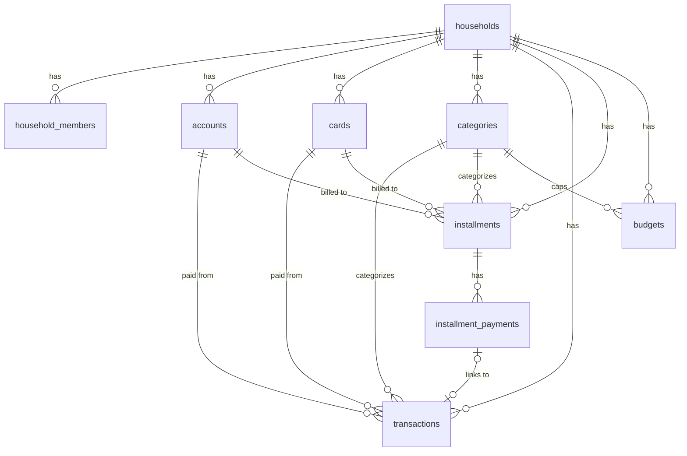

# Wealth Prof — เอกสารวิเคราะห์และออกแบบระบบ (v1)

> เอกสารนี้ต่อยอดจาก [SPEC.md](./SPEC.md) — วิเคราะห์สเปกเดิม เสนอการออกแบบสถาปัตยกรรม, data model, UX และแผนการพัฒนา สำหรับสร้างแอพจริงใน repo นี้

---

## 1. สรุปการวิเคราะห์สเปก

### 1.1 สิ่งที่สเปกเดิมทำได้ดีอยู่แล้ว (คงไว้)

* ขอบเขตชัด: แอพสำหรับ 2 คน ไม่ใช่ multi-tenant SaaS → ออกแบบให้เรียบง่ายได้มาก
* ฟีเจอร์ baseline จากต้นแบบครบวงจรแล้ว: บันทึก → ติดตามผ่อน → วางแผน
* มีข้อมูลจริง 600+ รายการเป็นชุดทดสอบ → ไม่ต้องเดา use case

### 1.2 จุดที่ควรปรับจากต้นแบบ (การตัดสินใจออกแบบสำคัญ)

| # | ต้นแบบเดิม | ปัญหา | ข้อเสนอใหม่ |
|---|---|---|---|
| D1 | คิดยอดผ่อนเป็น "รายเดือนปฏิทิน" | เงินจริงต้องจ่ายตาม **รอบบิลบัตร** (วันสรุปยอด/วันครบกำหนด) ไม่ใช่ตามเดือน — sheet เดิมก็สรุปตามรอบบิล | สร้าง **Billing Cycle Engine** เป็น logic กลาง (หัวข้อ 6.1) แล้วให้ทั้ง Dashboard, ปฏิทินผ่อน, หน้าบัตร ใช้ตัวเดียวกัน |
| D2 | "งวดที่จ่ายแล้ว" เป็นตัวนับ (counter) | กดพลาดแล้วแก้ยาก, ไม่รู้ว่าจ่ายเมื่อไหร่, ไม่เชื่อมกับ transactions | เก็บเป็น **event** ในตาราง `installment_payments` (จ่ายงวดไหน วันไหน ผูก transaction ได้) — ตัวนับกลายเป็นค่า derived, undo ได้ |
| D3 | "ยอดใช้บัตรรอบนี้" กรอกเอง | ซ้ำซ้อนกับ transactions ที่ผูกบัตรอยู่แล้ว เสี่ยงตัวเลขไม่ตรงกัน | คำนวณจาก transactions ในรอบบิลอัตโนมัติ + มีช่อง **ปรับยอด (adjustment)** ไว้เทียบกับ statement จริง |
| D4 | ยอดบัญชีกรอกเองล้วน | ลืมอัปเดตแล้วตัวเลขเพี้ยนสะสม | ใช้ pattern **reconcile**: บันทึก "ยอดตั้งต้น ณ วันที่ X" แล้วระบบบวก/ลบ transactions ให้เอง ผู้ใช้กด reconcile เทียบยอดจริงเป็นครั้งคราว |
| D5 | ดอกเบี้ยเก็บในช่องหมายเหตุ (เช่น "ผ่อน 9.99%") | คำนวณ avalanche อัตโนมัติไม่ได้ | แยกเป็นฟิลด์ตัวเลข `interest_rate` จริง ๆ (import ด้วย regex จากหมายเหตุเดิม) |
| D6 | ข้อมูลเป็น JSON ก้อนเดียว, ไม่มี auth | ชนกันเวลาแก้พร้อมกัน, ใครมีลิงก์เห็นหมด | Postgres + Row Level Security + login แยกคน (หัวข้อ 5) |

### 1.3 Pain point → ฟีเจอร์ที่ตอบโจทย์ตรง ๆ

* **สภาพคล่องตึงบางเดือน (เหลือ ~3,600)** → Dashboard ต้องโชว์ "ยอดที่ต้องเตรียมก่อนวันครบกำหนดถัดไป" เด่นที่สุดในหน้าแรก ไม่ใช่แค่สรุปเดือน
* **Cash advance 9.99% ปนกับผ่อน 0%** → หน้าแผนปลดหนี้ต้องแยกสี/เรียงตามดอกเบี้ยชัดเจน + simulator "ถ้ามีเงินโปะเพิ่ม X บาท ประหยัดดอกเบี้ยเท่าไหร่"
* **ไม่แยกรายรับ-รายจ่ายสองคน** → ทุก record มีฟิลด์ owner และทุกหน้าจอมี filter chip คนที่ 1 / คนที่ 2 / ร่วมกัน / ทั้งหมด ติดอยู่ตำแหน่งเดิมเสมอ

---

## 2. หลักการออกแบบ (Design Principles)

1. **Mobile-first จริงจัง** — ทุก flow ต้องทำจบได้ด้วยมือเดียวบนมือถือ; เว็บ desktop เป็นแค่ layout กว้างขึ้น
2. **บันทึกรายการต้องเร็วกว่า 10 วินาที** — นี่คือ action ที่ทำบ่อยที่สุด ถ้าช้าคนจะเลิกจด (เหตุผลเดียวกับที่ sheet เดิม "ใช้บนมือถือลำบาก")
3. **ตัวเลขเดียว มาจากที่เดียว** — logic คำนวณ (รอบบิล, ยอดผ่อนคงเหลือ, วงเงิน) อยู่ใน module เดียว ทุกหน้าจอเรียกใช้ร่วมกัน ห้าม copy สูตร
4. **แก้ผิดได้เสมอ** — ทุก action สำคัญ (จ่ายงวด, ลบรายการ) undo ได้ หรืออย่างน้อยแก้ย้อนหลังได้ง่าย
5. **เริ่มเล็ก ขยายได้** — schema ออกแบบเผื่อเฟสลงทุน/เกษียณ แต่ไม่ implement ล่วงหน้า

---

## 3. Tech Stack ที่แนะนำ

| ส่วน | เลือกใช้ | เหตุผล |
|---|---|---|
| Frontend | **React 18 + TypeScript + Vite** (SPA) | ไม่ต้องมี server-side rendering — แอพส่วนตัว 2 คน ไม่มี SEO; SPA ทำ PWA/offline ง่ายกว่า Next.js และ deploy เป็น static ได้ฟรี |
| UI | **Tailwind CSS + shadcn/ui** | ทำ mobile UI สวย/เร็ว, dark mode ฟรี, ปรับแต่งเป็นภาษาไทยง่าย |
| State/Data | **TanStack Query** + Supabase JS client | cache + optimistic update + persist ลง IndexedDB (ได้ offline read ฟรีเกือบทั้งก้อน) |
| Backend/DB | **Supabase** (Postgres + Auth + Realtime) | ครบในตัวเดียว: DB จริง, login, sync real-time, Row Level Security; free tier เหลือเฟือสำหรับ 2 ผู้ใช้ |
| Charts | **Recharts** | เบา พอสำหรับกราฟแนวโน้ม + bar list |
| PWA | **vite-plugin-pwa** (Workbox) | installable + cache shell + offline read |
| Hosting | **Vercel** (static) | deploy จาก GitHub อัตโนมัติ, custom domain ฟรี |
| Testing | **Vitest** | เน้น unit test ที่ logic การเงิน (รอบบิล/avalanche) เป็นหลัก |

**ทางเลือกที่พิจารณาแล้วไม่เลือก:**

* *Next.js* — ได้ประโยชน์หลัก ๆ ตอนมี SSR/SEO ซึ่งแอพนี้ไม่ต้องการ; เพิ่ม complexity ของ server components โดยไม่จำเป็น
* *Firebase* — Firestore เป็น NoSQL ทำ query สรุปรายเดือน/รายรอบบิลยากกว่า SQL มาก
* *ทำ backend เอง (Express/Nest)* — ไม่คุ้มสำหรับ 2 ผู้ใช้; Supabase RLS แทน API layer ได้เลย

### สถาปัตยกรรมรวม

```mermaid
flowchart LR
    subgraph มือถือ/เว็บ ของทั้งสองคน
        A[React PWA<br/>Vite + Tailwind]
        B[(IndexedDB cache<br/>offline read)]
        A <--> B
    end
    A <-->|Supabase JS<br/>+ RLS| C[(Supabase Postgres)]
    C -->|Realtime<br/>subscription| A
    D[Supabase Auth<br/>email+password] --- A
    E[Vercel static hosting] --- A
```

ไม่มี API server ของตัวเอง: client คุยกับ Supabase ตรง ๆ ความปลอดภัยคุมด้วย **Row Level Security** ที่ระดับ database (ต่อให้ client โดน reverse ก็เห็นได้แค่ข้อมูล household ตัวเอง)

---

## 4. Data Model

### 4.1 ERD



### 4.2 Schema (Postgres)

```sql
-- ครัวเรือน: หน่วยแชร์ข้อมูล (แอพนี้มีจริง ๆ แค่ 1 แถว แต่ออกแบบให้ถูกไว้)
create table households (
  id          uuid primary key default gen_random_uuid(),
  name        text not null default 'บ้านเรา',
  created_at  timestamptz not null default now()
);

-- สมาชิก: ผูก auth.users ของ Supabase เข้ากับ household
create table household_members (
  id            uuid primary key default gen_random_uuid(),
  household_id  uuid not null references households(id),
  user_id       uuid unique references auth.users(id),  -- null ได้ตอนยังไม่ accept invite
  display_name  text not null,                          -- ชื่อเล่นที่โชว์ทั้งแอพ
  invite_code   text unique,                            -- ใช้ตอนชวนคนที่สอง
  created_at    timestamptz not null default now()
);

-- owner ของข้อมูลทุกชนิด: member id หรือ null = "ร่วมกัน"
-- (ใช้ nullable FK แทน enum คนที่1/คนที่2 เพื่อให้ชื่อ/จำนวนคนยืดหยุ่น)

create type account_type as enum ('bank', 'cash', 'ewallet');

create table accounts (
  id             uuid primary key default gen_random_uuid(),
  household_id   uuid not null references households(id),
  name           text not null,
  type           account_type not null default 'bank',
  owner_id       uuid references household_members(id),   -- null = ร่วมกัน
  anchor_balance numeric(14,2) not null default 0,        -- ยอดตั้งต้น ณ วัน anchor
  anchor_date    date not null default current_date,      -- ดู D4: ยอดปัจจุบัน = anchor + sum(txn หลัง anchor)
  sort_order     int not null default 0,
  archived       boolean not null default false
);

create table cards (
  id             uuid primary key default gen_random_uuid(),
  household_id   uuid not null references households(id),
  name           text not null,
  credit_limit   numeric(14,2) not null,
  statement_day  int not null check (statement_day between 1 and 31),
  due_day        int not null check (due_day between 1 and 31),
  interest_rate  numeric(5,2) not null default 0,         -- %/ปี
  owner_id       uuid references household_members(id),
  cycle_adjustment numeric(14,2) not null default 0,      -- ดู D3: ปรับยอดเทียบ statement จริง
  sort_order     int not null default 0,
  archived       boolean not null default false
);

create type category_kind as enum ('income', 'expense');

create table categories (
  id            uuid primary key default gen_random_uuid(),
  household_id  uuid not null references households(id),
  name          text not null,
  kind          category_kind not null,
  icon          text,                                     -- ชื่อ icon/emoji
  sort_order    int not null default 0,
  archived      boolean not null default false
);

create table transactions (
  id            uuid primary key default gen_random_uuid(),
  household_id  uuid not null references households(id),
  date          date not null,
  kind          category_kind not null,                   -- รายรับ/รายจ่าย (ซ้ำกับ category เพื่อ query เร็ว)
  category_id   uuid not null references categories(id),
  description   text not null default '',
  amount        numeric(14,2) not null check (amount > 0),
  owner_id      uuid references household_members(id),    -- null = ร่วมกัน
  account_id    uuid references accounts(id),             -- จ่ายจากบัญชี...
  card_id       uuid references cards(id),                -- ...หรือรูดบัตร (อย่างใดอย่างหนึ่ง)
  note          text,
  created_by    uuid references household_members(id),
  created_at    timestamptz not null default now(),
  check (account_id is null or card_id is null)
);
create index on transactions (household_id, date desc);

create type installment_status as enum ('active', 'done', 'cancelled');

create table installments (
  id              uuid primary key default gen_random_uuid(),
  household_id    uuid not null references households(id),
  name            text not null,
  category_id     uuid references categories(id),
  start_date      date not null,                          -- งวดที่ 1 อยู่รอบบิลที่ครอบวันนี้
  total_periods   int not null check (total_periods > 0),
  monthly_amount  numeric(14,2) not null,
  card_id         uuid references cards(id),              -- ผูกบัตร...
  account_id      uuid references accounts(id),           -- ...หรือตัดบัญชี
  interest_rate   numeric(5,2) not null default 0,        -- ดู D5: ฟิลด์ตัวเลขจริง
  is_cash_advance boolean not null default false,         -- ธงพิเศษสำหรับกดเงินสด
  owner_id        uuid references household_members(id),
  note            text,
  status          installment_status not null default 'active',
  check (card_id is null or account_id is null)
);

-- ดู D2: การจ่ายแต่ละงวดเป็น event ไม่ใช่ตัวนับ
create table installment_payments (
  id              uuid primary key default gen_random_uuid(),
  installment_id  uuid not null references installments(id) on delete cascade,
  period_no       int not null,                           -- งวดที่เท่าไหร่
  paid_date       date not null default current_date,
  transaction_id  uuid references transactions(id),       -- ผูกรายการจ่ายจริง (optional)
  unique (installment_id, period_no)
);
-- งวดที่จ่ายแล้ว = count(*), ยอดคงเหลือ = (total - count) * monthly_amount

create table budgets (
  id            uuid primary key default gen_random_uuid(),
  household_id  uuid not null references households(id),
  category_id   uuid not null references categories(id),
  amount        numeric(14,2) not null,
  month         date,                                     -- null = ค่า default ทุกเดือน, ระบุ = override เดือนนั้น
  unique (household_id, category_id, month)
);
```

### 4.3 Row Level Security (แนวคิด)

ทุกตารางเปิด RLS ด้วย policy เดียวกัน:

```sql
-- helper: household ของ user ปัจจุบัน
create function current_household_id() returns uuid
language sql stable security definer as $$
  select household_id from household_members where user_id = auth.uid()
$$;

-- ตัวอย่าง policy (ใช้ pattern เดียวกันทุกตาราง)
alter table transactions enable row level security;
create policy member_all on transactions
  for all using (household_id = current_household_id())
  with check (household_id = current_household_id());
```

---

## 5. Authentication & การเชื่อมสองคน

* **Supabase Auth แบบ email + password** (มี "จำฉันไว้" session ยาว ๆ) — magic link ใช้ได้แต่บนมือถือมักสลับแอพไป Gmail แล้วหลุด flow; password ตั้งครั้งเดียวจบ
* Flow ครั้งแรก:
  1. คนที่ 1 สมัคร → ระบบสร้าง household + member ให้อัตโนมัติ
  2. หน้า Settings มีปุ่ม "ชวนอีกคน" → สร้าง invite code / ลิงก์
  3. คนที่ 2 สมัครผ่านลิงก์ → ผูกเข้า household เดียวกัน
* หลัง login ค้าง session ไว้นาน (refresh token ของ Supabase) — เปิดแอพแล้วใช้ได้เลย ไม่ต้อง login ซ้ำทุกครั้ง ตอบโจทย์ "ไม่ต้องการระบบ login ซับซ้อน" โดยไม่เสียความปลอดภัย
* `owner_id` ของ transaction ตั้ง default = คนที่ login อยู่ (เปลี่ยนได้ตอนกรอก)

---

## 6. Logic การเงินหลัก (หัวใจของแอพ — ต้องมี unit test ครบ)

รวมไว้ใน module เดียว เช่น `src/lib/finance/` ใช้ร่วมกันทุกหน้าจอ (หลักการข้อ 3)

### 6.1 Billing Cycle Engine (ตอบโจทย์ #2 ของสเปกโดยตรง)

แก้ปัญหา D1 — แปลง "เดือนปฏิทิน" ให้เป็น "รอบบิลของแต่ละบัตร":

```
รอบบิลของบัตร (statement_day = S, due_day = D):
  รอบบิล k ครอบวันที่:  (S ของเดือน M-1) + 1  →  S ของเดือน M
  วันครบกำหนดจ่าย:      D ของเดือน M   (ถ้า D <= S ให้เลื่อนเป็น D ของเดือน M+1)
  กรณีเดือนสั้น (S=31 แต่เดือนมี 30 วัน): ใช้วันสุดท้ายของเดือน
```

ฟังก์ชันหลัก:

```ts
// งวดที่ n ของ installment เกิดวันไหน (start_date + (n-1) เดือน)
periodDate(inst: Installment, n: number): Date

// รายการผ่อน/transaction ตกอยู่รอบบิลไหนของบัตรนั้น
cycleOf(card: Card, date: Date): { start: Date; end: Date; dueDate: Date }

// ยอดที่ต้องจ่ายของบัตรในรอบบิลหนึ่ง =
//   sum(transactions ที่รูดบัตรในรอบ) + sum(ค่างวด installment ที่งวดตกในรอบ) + cycle_adjustment
cycleBill(card: Card, cycle: Cycle, txns, insts): number

// ตารางล่วงหน้า 12 เดือน: ต่อบัตร/บัญชี ต่อรอบบิล → ใช้ทั้งหน้า Plan และ Dashboard
forwardSchedule(cards, accounts, insts, months = 12): ScheduleRow[]
```

### 6.2 ยอดผ่อนและวงเงินบัตร

```
งวดที่จ่ายแล้ว        = count(installment_payments)
ยอดผ่อนคงเหลือ        = (total_periods - งวดที่จ่ายแล้ว) × monthly_amount
วงเงินใช้ไป (ต่อบัตร)  = ยอดรอบบิลปัจจุบัน + ยอดผ่อนคงเหลือของ installments ที่ผูกบัตร
วงเงินเหลือ           = credit_limit - วงเงินใช้ไป
```

### 6.3 ยอดบัญชี (reconcile pattern — D4)

```
ยอดปัจจุบัน = anchor_balance
            + sum(รายรับเข้าบัญชี หลัง anchor_date)
            - sum(รายจ่ายจากบัญชี หลัง anchor_date)
กด "Reconcile" = กรอกยอดจริงจากแอพธนาคาร → ระบบตั้ง anchor ใหม่เป็นวันนี้
```

### 6.4 แผนปลดหนี้ (Avalanche + Simulator)

* เรียง installments ที่ active ตาม `interest_rate` มาก → น้อย (cash advance 9.99% ขึ้นบนสุดอัตโนมัติ, tie-break ด้วยยอดคงเหลือน้อยก่อนเพื่อปิดเป็นรายการ ๆ)
* **Simulator**: ผู้ใช้กรอก "เงินโปะเพิ่มต่อเดือน" → จำลองการโปะตามลำดับ avalanche แสดง (ก) ปิดหนี้เร็วขึ้นกี่เดือน (ข) ประหยัดดอกเบี้ยประมาณเท่าไหร่ — ตัวเลข "ประหยัดได้ X บาท" คือแรงจูงใจที่ทำให้ฟีเจอร์นี้ถูกใช้จริง
* หมายเหตุ: ดอกเบี้ยผ่อน 0% ที่มี "ค่าธรรมเนียม" ให้กรอกเป็น rate เทียบเท่าในฟิลด์เดียวกัน

### 6.5 ตัวเลขหน้า Dashboard (ลำดับความสำคัญตาม feedback ผู้ใช้)

* **การ์ดหลัก (บนสุด): สรุปรายเดือน** — รายรับ / รายจ่าย / คงเหลือ ของเดือนที่เลือก แยกตามคน — ตอบคำถาม "ต่อเดือนใช้จ่ายอะไรเท่าไหร่"
* **การ์ดรอง: รอบบิลถัดไป** — "ต้องเตรียมเงิน X บาท" = sum ของ `cycleBill` ทุกบัตรที่ยังไม่ถึง due date ถัดไป + งวด installment ที่ตัดบัญชีตรงในช่วงเดียวกัน — เรียงตาม due date พร้อม countdown "อีก N วัน" — ตอบคำถาม "เหลือบิลอะไรบ้าง ต้องเตรียมเท่าไหร่"

---

## 7. การออกแบบ UX

### 7.1 โครงหน้าจอ (mobile-first)

```
┌──────────────────────────────┐
│  ‹ ก.ค. 2569 ›   [คน1|คน2|รวม|ทั้งหมด]   ← header ติดบนทุกหน้า
│                              │
│         เนื้อหาแท็บ           │
│                              │
│                        (+)   │  ← FAB เพิ่มรายการ ลอยทุกหน้า
├──────────────────────────────┤
│ ภาพรวม  รายการ  ผ่อน  บัญชี  แผน │  ← bottom nav 5 แท็บ
└──────────────────────────────┘
```

* **ตัวเลือกเดือน + filter คน อยู่ที่เดียว มีผลทุกแท็บ** — ไม่ต้องตั้งใหม่ทุกหน้า (จำค่าไว้ใน URL/state)
* Settings ย้ายไปอยู่หลัง avatar มุมขวาบน (ไม่เปลืองแท็บ)
* Desktop: bottom nav กลายเป็น sidebar, เนื้อหาเป็น 2 คอลัมน์ — component เดิมทั้งหมด

### 7.2 Quick-add: flow ที่สำคัญที่สุด (หลักการข้อ 2)

กด FAB → bottom sheet เดียวจบ:

1. **ตัวเลขขึ้นก่อน** (numpad เปิดอัตโนมัติ) — สิ่งแรกที่ผู้ใช้รู้คือจำนวนเงิน
2. หมวดหมู่เป็น **grid ไอคอน** (ไม่ใช่ dropdown) เรียงตามที่ใช้บ่อย
3. ค่า default ฉลาด ๆ: วันที่ = วันนี้, ประเภท = รายจ่าย, เจ้าของ = คนที่ login, บัญชี/บัตร = อันล่าสุดที่ใช้กับหมวดนั้น
4. คำอธิบาย + หมายเหตุ = optional พับไว้
5. กดบันทึก → optimistic update เห็นผลทันที, toast มีปุ่ม undo

เป้าหมาย: กรณีทั่วไป (ค่ากาแฟ 65 บาท) = **แตะ 4 ครั้ง**: FAB → 65 → หมวดอาหาร → บันทึก

### 7.3 หน้าอื่น ๆ (เฉพาะจุดที่ต่างจาก baseline)

* **ภาพรวม**: บนสุดคือสรุปรายเดือน (หลัก) → การ์ด "ต้องเตรียมเงินรอบบิลถัดไป" (รอง) เรียงตาม due date ใกล้สุด → กราฟ 6 เดือน → bar หมวดหมู่ (แตะหมวด → เจาะดูรายการ) — ดู 6.5
* **รายการ**: list จัดกลุ่มตามวัน, แถวเดียวเห็น หมวด(ไอคอน)/ชื่อ/บัญชี/owner(สี)/จำนวน, ปัดซ้ายเพื่อแก้/ลบ, ค้นหาข้อความได้
* **ผ่อน**: card ต่อรายการ มี progress bar, ป้ายเตือนดอกเบี้ย ≥5% สีแดง, ปุ่ม "จ่ายงวดนี้" กดครั้งเดียว (สร้าง `installment_payment` + เสนอสร้าง transaction คู่กันอัตโนมัติ), รายการที่ผ่อนจบย้ายไปส่วน "เสร็จแล้ว" พับไว้
* **บัญชี**: สองส่วน (บัญชี/บัตร) ตาม baseline; บัตรโชว์ mini-gauge วงเงินใช้ไป/เหลือ + วันสรุปยอด/due ถัดไป; ปุ่ม Reconcile ต่อบัญชี
* **แผน**: 3 sub-tab ตาม baseline — ปฏิทินผ่อน (ตาราง เดือน × บัตร/บัญชี, เดือนที่ยอดสูงไฮไลต์), งบประมาณ (bar เขียว/เหลือง/แดง), ปลดหนี้ (avalanche + simulator)

### 7.4 ภาษาและรูปแบบ

* UI ภาษาไทยทั้งหมด, จำนวนเงิน format `1,234.50` สกุลบาท, วันที่ พ.ศ. แบบย่อ ("21 ก.ค. 69")
* สีประจำคน (เช่น คนที่ 1 = ฟ้า, คนที่ 2 = ส้ม, ร่วมกัน = ม่วง) ใช้สม่ำเสมอทุกหน้าจอ ทั้ง chip, ขอบการ์ด, กราฟ

---

## 8. Real-time Sync และ Offline

* **Sync**: subscribe Supabase Realtime (postgres_changes ของ household ตัวเอง) → invalidate TanStack Query → UI อัปเดตเองภายใน ~1 วินาที เมื่ออีกคนบันทึก ไม่ต้องทำ CRDT/merge เพราะ conflict จริงแทบไม่มี (คนละ record กัน) — record เดียวกันใช้ last-write-wins พอ
* **Offline (เฟสแรก: read-only)**:
  * PWA cache app shell → เปิดแอพได้เสมอ
  * TanStack Query persist ลง IndexedDB → เห็นข้อมูลล่าสุดที่เคยโหลด พร้อม banner "ออฟไลน์ — ข้อมูล ณ เวลาที่ sync ล่าสุด"
  * การเขียนตอนออฟไลน์: เฟสแรกแจ้งว่าต้องต่อเน็ต (ปุ่ม disabled + เหตุผล) — write-queue แบบ sync ทีหลังมี edge case เยอะ (แก้ record เดียวกันสองเครื่อง) เก็บไว้เฟสหลังถ้าจำเป็นจริง
* **PWA**: manifest + icon → "Add to Home Screen" ได้ทั้ง iOS/Android แก้ปัญหา "ไม่มี native app icon" ของต้นแบบ

---

## 9. การ Import จาก Google Sheet

* เขียนเป็น script (`scripts/import-sheet.ts`) รับไฟล์ CSV ที่ export จาก 4 แท็บ: รายการเคลื่อนไหว, Installment, Credit Card, บัญชี
* Mapping สำคัญ:
  * ดอกเบี้ยใน "หมายเหตุ" ("ผ่อน 0.74%", "ผ่อน 9.99%") → regex ดึงเป็น `interest_rate`; 9.99% ตั้ง `is_cash_advance = true`
  * "งวดที่ชำระแล้ว = n" → generate `installment_payments` งวด 1..n ย้อนหลัง (paid_date = วันที่งวดตาม `periodDate`)
  * รายการที่ไม่ระบุคน → owner = ร่วมกัน (ไปแก้ทีหลังได้)
* รันซ้ำได้ (idempotent — ล้างข้อมูล household แล้ว insert ใหม่ตาม baseline 4.6) และมีปุ่ม trigger ใน Settings
* หลัง import แสดงหน้าสรุป: จำนวน record ต่อชนิด + รายการที่ parse ไม่ได้ให้ตรวจ

---

## 10. แผนการพัฒนา (Roadmap)

| เฟส | ขอบเขต | เกณฑ์เสร็จ |
|---|---|---|
| **0. Foundation** | ตั้งโปรเจกต์ Vite+TS+Tailwind, Supabase (schema+RLS+migration), CI (typecheck+test), deploy Vercel | เปิด URL ได้, login ได้, DB มี schema ครบ |
| **1. Core บันทึก** | Auth+invite, Accounts/Cards/Categories CRUD, Transactions + quick-add, import จาก Sheet | ทั้งสองคนใช้แทน sheet ได้ในชีวิตประจำวัน |
| **2. ผ่อน + รอบบิล** | Installments + จ่ายงวด, Billing Cycle Engine + unit tests, Dashboard "ต้องเตรียมเงิน", วงเงินบัตร | ตัวเลข "ต้องจ่ายต่อบัตรต่อรอบบิล" ตรงกับ sheet เดิม |
| **3. วางแผน** | ปฏิทินผ่อน 12 เดือน, งบประมาณรายหมวด, Avalanche + simulator | ใช้ตัดสินใจโปะหนี้ได้จริง |
| **4. Polish** | PWA + offline read, Realtime sync, dark mode, กราฟครบ, reconcile | ติดตั้งบนมือถือทั้งสองเครื่อง ใช้ลื่น |
| **5. อนาคต** | วางแผนลงทุน/เกษียณ (ยังไม่ออกแบบ — คุยเพิ่มตอนถึงเฟส), แจ้งเตือน due date (push), export ข้อมูล | — |

> เฟส 1 คือจุด "ใช้แทน sheet ได้" — ควรไปให้ถึงเร็วที่สุดแล้วให้ผู้ใช้จริงป้อน feedback ก่อนทำเฟสถัดไป

---

## 11. ความเสี่ยง / ข้อควรระวัง

* **ความถูกต้องของ logic รอบบิล** คือความเสี่ยงอันดับหนึ่ง — ตัวเลขผิดแปลว่าเตรียมเงินผิด ต้องมี unit test cover กรณี: วันสรุปยอดปลายเดือน (29/30/31), due ข้ามเดือน, งวดแรก/งวดสุดท้าย, ปีอธิกสุรทิน และ**เทียบผลกับตัวเลขจริงใน sheet เดิมทุกบัตรก่อนเชื่อ**
* **ข้อมูลการเงินละเอียดอ่อน** — เปิด RLS ทุกตาราง, ไม่เก็บเลขบัตรจริง (เก็บแค่ชื่อเรียก), ระวังไม่ log ข้อมูลเงินขึ้น analytics ใด ๆ
* **Timezone** — เก็บ `date` เป็น date เพลน ๆ (ไม่ใช่ timestamp) ตีความตามเวลาไทยเสมอ กันเคสบันทึกตอนเที่ยงคืนแล้วตกผิดวัน/ผิดรอบบิล
* **Free tier ของ Supabase** — project pause เมื่อไม่มี traffic 7 วัน; แอพที่ใช้ทุกวันไม่โดน แต่ควรรู้ไว้ (มี cron ping เป็น mitigation ได้)
